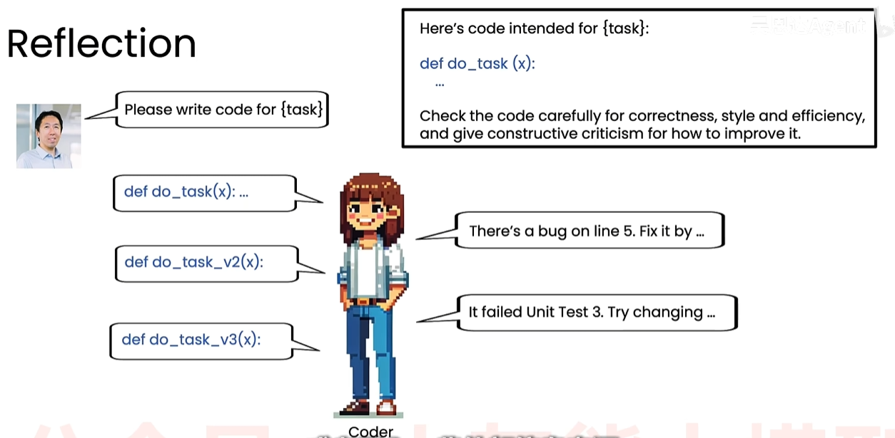

# 吴恩达（Andrew Ng）说Agent

**如何区分一个开发人员是否真的懂Agent AI？**

> 一个真正懂Agent AI的开发者：**规范/标准的开发流程**、明确**Agent评估**和**错误分析**流程。

## Agent AI是什么？

> Agent AI指通过LM应用执行多步操作来完成任务。

研究型Agent AI：**调研/思考   →  修改**   →  调研/思考    →  修改，如此迭代循环

例如：让Agent写一篇文章

1. 让LLM - A 决定是否需要搜索、搜索哪些内容来获取相关内容(tools)
2. 基于搜索内容让LLM- A写草稿
3. 用另一个LLM - B来评审  →  看哪些地方需要进一步修改（LLM - B可以决定是否需要加入人工评审环节）
4. LLM - A根据评审再次修改草稿。 
5. 如此迭代循环，就可以写出一篇高质量的文章

> 当然这样做更加耗时，但是产出质量更高。其实人需要写出一篇高质量的文章也需要如此。

## 为什么Agent AI如此强大？

低自主 →  中等自主 →  高度自主，这是Agent发展的必经之路。

- 在多种应用场景下表现优异
- 并行处理任务
- 模块化设计

比如：发票信息录入、AI售后服务

## 构建智能体工作流的关键

任务拆解流程：

- 分析人是如何处理任务的，识别可以用哪些独立步骤实现
- 当分析具体独立步骤时，考虑该步骤是否可以使用大模型语言/调用API完成？如果不能，继续深追作为人这时候怎么处理，能否可以进一步拆分为独立步骤，能否使用大模型语言/调用API完成？

> 构建基本Agent，通过不断的分析、任务拆解、优化来不断迭代

## 持续优化 - 评估

一个人能否高效完成任务：取决于**能否制定高度规范化的评估流程**

- 端到端，衡量整个智能体的输出质量
- 组件级评估，衡量智能体某一步的输出质量

## 智能体设计模式

通过组合模块、串联出复杂的智能体工作流。

- 反思（Reflection）

  > 其实就是让AI自己（或者另一个LLM ）检查自己的输出，或者引入一些外部信息（运行测试案例得到的报错信息等），通过不断的迭代生成高质量的结果。

- 工具使用（Tool use）

  > LLM可以调用工具（函数）来完成任务，

- 规划（Planning）

- 多智能体协作（Muti-agent collaboration）

### 反思（Reflection）

>coder：请写一代码来实现我的**{任务}**
>
>AI: 生成代码如下：def do_task(x): ....
>
>coder: 这里有一段**{代码}**，请检查代码是否存在代码错误、格式、效率等问题，给出可行建议来优化。
>
>AI：line5有一处bug....
>
>coder：如果条件允许，可以常识运行代码，如果有测试案例不通过，也可以给AI反馈，让它修改
>
>AI：.....

简单来说，反思模式就是让 AI 智能体像人类一样 **“做完事情后回头检查、发现问题、修正优化”，核心是为智能体引入“执行 - 评估 - 反思 - 优化” 的闭环反馈循环 **，而非让模型一次性生成结果就结束。

- 核心步骤：执行（生成初始输出）→ 评估（检查准确性 / 完整性 / 逻辑性等问题）→ 反思（找到改进方向）→ 优化（生成更优结果），可反复迭代；
- 核心特点：既可以让单个模型自我反思，也能让两个模型 “分工协作”（一个生成、一个评估修正），还能结合外部反馈（如真实测试结果、标准答案）让优化更精准；
- 核心价值：减少 AI “幻觉”、提升输出的准确性和合规性，甚至能让 GPT-3.5 这类模型在部分任务上表现超越 GPT-4。 

例如：代码编写与调试

1. AI 先生成代码初稿；
2. 把代码运行的**报错日志**（外部反馈）交给 AI；
3. AI 检查报错原因（如语法错误、逻辑漏洞、函数调用错误）；
4. 针对性修改代码，直到能正常运行

### 为什么不直接使用LLM生成？

LLM 的单次直接生成模式，无法适配复杂任务的需求，输出质量、鲁棒性远低于 Agentic AI 的多步迭代工作流

- 实验数据证明 “直接生成” 的性能远低于迭代工作流

> 吴恩达团队在 HumanEval 代码生成基准测试、多类文本 / 问答任务中做了对比实验：相同的 LLM 模型（如 GPT-3.5、GPT-4），**开启反射 / 迭代的 Agent 工作流后，性能显著优于直接的零样本生成**，甚至让 GPT-3.5 在部分任务上的表现超越了单次生成的 GPT-4。

- 单次生成无反馈修正，无法规避核心问题

> LLM 直接生成没有 “评估 - 反思 - 优化” 的闭环，无法发现自身的错误（如事实性幻觉、逻辑漏洞、格式错误），也无法结合外部反馈（如代码报错、真实数据、业务规则）进行修正，而这正是 Agentic AI 工作流的核心优势。

### 基于反思的提示词

自行搜索

### 反思评估

> **案例场景：零售店数据查询 (Text-to-SQL)**
>
> - **用户需求**：一位非技术人员想知道：“哪种颜色的产品在过去三个月里的总销售额最高？”
> - **输入**：自然语言问题 + 数据库表结构（Schema）。
> - **目标**：生成一段能够准确运行并返回正确结果的 SQL 代码。
>
> ------
>
> **案例的两种方式（反思与不反思）**
>
> - **无反思 (Baseline) —— “直觉驱动”**
>
> 1. 动作：模型接收问题，直接生成 SQL 语句。
> 2. 结果：准确率约为 87%。
> 3. 失败原因（因果）：模型可能会遗漏 JOIN 条件、写错字段名（如把 `total_sales` 写成 `sales_amount`），或者在处理复杂的聚合逻辑（如日期筛选）时出现语法错误。因为是单次输出，模型没有机会检查自己的逻辑漏洞。
>
> - **带反思 (Reflection) —— “逻辑修正驱动”**
>
> ​	分为三个核心步骤：
>
> 1. 模型接收问题，直接生成 SQL 语句。
>    - LLM 生成第一版 SQL。假设它在 `WHERE` 子句中漏掉了对“过去三个月”的时间限制。
> 2. 反思环节 (The "Cause" of Improvement)
>    - **触发条件**：系统将初稿交给另一个 Prompt（或另一个 LLM 实例），任务是：“检查这段 SQL 是否完全符合用户要求？是否存在语法错误或性能问题？”
>    - **发现问题**：反思代理（Reflector）注意到：“SQL 缺少了对日期的过滤，且 `GROUP BY` 子句不完整。”
>    - **产生反馈**：它输出一段文字反馈：“错误：未过滤近三个月数据。建议：添加 `WHERE date > ...` 并检查分组字段。”
> 3. 迭代改进 (Refining)
>    - LLM 接收“初稿 + 反馈”，重新生成 SQL。
> 4. 结果：准确率提升至 **95%**。