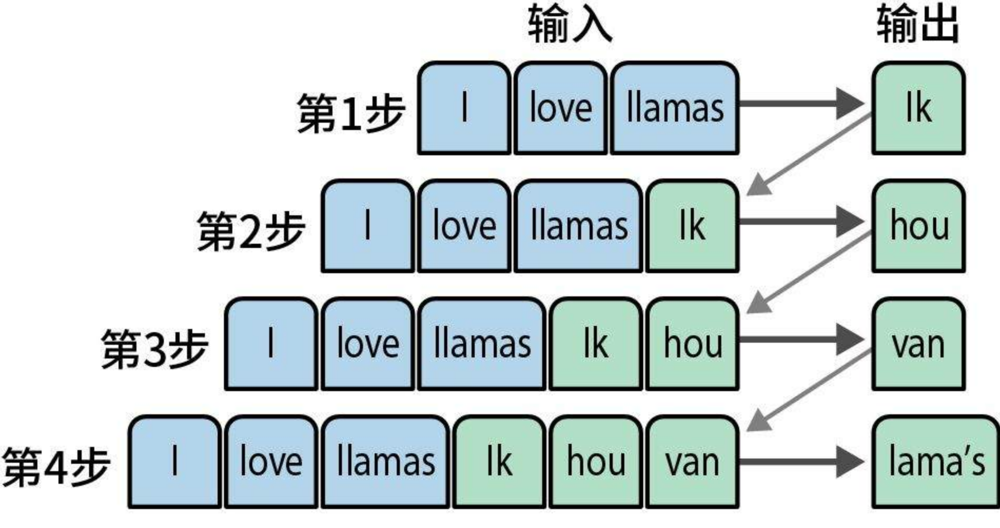
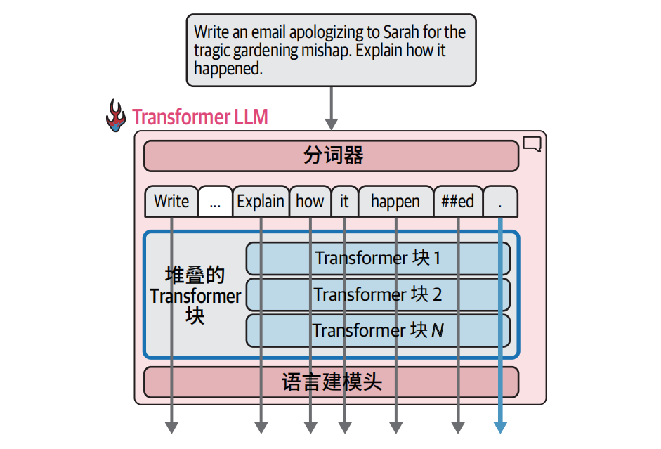
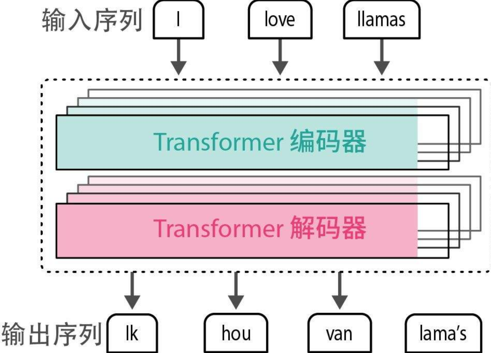
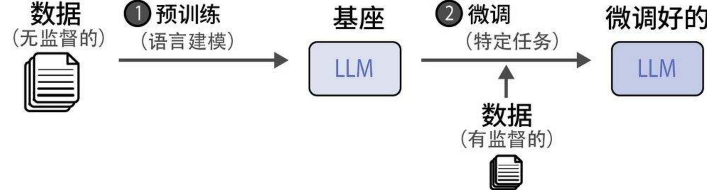

# 大模型应用开发

## 什么是词元（token）？

词元也叫token，是词表的最小单位，它可以是字符串/字/词/字词/符号等。

## 什么是词表？

- 词表由分词器训练生成，取决于词表大小、训练数据、分词算法；同一个分词器，词表一定相同
- 词表是模型的字典（词元集合），模型只认识词表内的token，所以词表也决定了模型能认识和输出哪些字、词。
- 词表由2张独立的表组成（即token和id的双向对照表），正表token → id用于将自然语言文本转为id序列，供模型处理；反表 id → token用于将模型输出的id转回自然语言文本，供人类阅读。

## 什么是分词？

分词是分词器将自然语言文本转为token id序列的过程。分词器不同 → 词表不同 → 切分方式不同 → 相同文本得到的token id序列不同

## 什么是词袋（Bag Of Words）？

词袋是一种表示文本的方式，只计算文本中每个token出现的次数，不考虑顺序、语法、上下文、语义等。



例如：

```text
句子1：我 喜欢 大模型
句子2：大模型 喜欢 我

分词后（传统分词，不是大模型Token）：

- 句子1：[我, 喜欢, 大模型]

- 句子2：[大模型, 喜欢, 我]

词袋表示（统计次数）：
我:1，喜欢:1，大模型:1

两句话顺序完全相反，但词袋一模一样。
```

> 这就是词袋：只看有没有、有几次，不看顺序、不看意思。

## 什么是嵌入(Embedding)？

嵌入就是把"离散的、符号化的东西"映射成"连续的、低维的稠密向量"的过程，它可以是词嵌入、位置嵌入、句嵌入、用户ID嵌入、类别嵌入等等

### 词嵌入(Word Embedding)

词嵌入就是把token id转变为多维向量的过程，词嵌入分为两种

- 静态嵌入（Static Embedding）
- 动态嵌入 = 上下文嵌入（Contextual Embedding） = Transformer嵌入

静态嵌入

静态嵌入，就是把单个token id映射为一个固定向量的过程（使用token id在嵌入层向量表中查询），不包含上下文信息。它通过专门的向量训练（如Word2Vec、Glove）或模型嵌入层训练得到，训练完成后就形成一张固定的嵌入层向量表，一个词对应一个固定向量。

注意：

- 词嵌入使用的是全局共享向量空间，该空间在设计模型、定义网络结构时就固定好的（hidden_size = 768，768维）
- 词嵌入是通过映射查表方式取出固定向量

> 特点：查表、固定、无上下文、全局共享

上下文嵌入(Contextual Embedding)

上下文嵌入就是把一整段token id序列，一起输入模型，经过自注意力机制融合上下文信息后，为序列中得每个token分别生成一个带上下文语义的向量，同一个token在不同句子里语义不同，向量也会不同。如：BERT、Transformer

> 上下文嵌入也叫动态嵌入、transformer嵌入

注意：

- 除了最后一层线性映射，要映射到词表维度，用于预测下一个词以外，其它所有计算得到的向量都在用同一个全局向量空间里（由hidden_size 决定维度数）。这些操作都是在移动向量到更着准确的位置。

> 整段token id序列 → 为每个token生成一个融合了整句上下文语义得向量

## 嵌入层向量表（Embedding）是什么？

嵌入向量表（token id  →  向量）是模型参数的一部分，跟着模型一起训练所得；模型不同/训练数据不同，向量表不同，同一个模型使用的是一张向量表。编码器和解码器共享一张Embedding表那么他们的静态嵌入向量值相同，如果不共享就不同

> 共享 →  相同
>
> 不共享  →  不相同

## 嵌入、词嵌入、词向量、嵌入向量有什么区别？

他们的侧重点不同：嵌入强调的是把词变为数字的动作，词嵌入强调的是把词变为数字的这种技术手段，词向量强调的是这组数字，嵌入向量强调的是这组数字是由语义的，词向量是利用神经网络由大量数据

## 模型在训练的过程中，它到底都训练了什么东西？

模型训练，就是在更新所有可学习参数，包括：

- 嵌入层的向量表（token id → 向量）
- 自注意力层的 Q/K/V 权重
- FFN 层权重
- 最后输出层的线性映射权重

## 模型的上下文长度

Transformer 模型对一次可以并行处理的词元数量有限制，这个限制被称为模型的上下文长度。一个具有 4K 上下文长度的模型只能并行处理 4000 个词元（即4000个计算溜），只有最后一条计算流的输出结果用于预测下一个词元



```text
假设你的输入是：我 爱 中 国（4 个 token）

Transformer 做的事：

- 并行一次性算出 4 个向量：
  - 第 1 个向量："我" 的语义（含上下文）
  - 第 2 个向量："爱" 的语义（含上下文）
  - 第 3 个向量："中" 的语义（含上下文）
  - 第 4 个向量："国" 的语义（含上下文）

这 4 个是同时算出来的 → 这就是 并行。

但现在任务是：

预测下一个词是什么

模型要回答的是：

"我爱中国" → 接下来应该是什么词？

你觉得应该用哪个位置的语义？

- 用第 1 个（我）？不行，太靠前。
- 用第 2 个（爱）？不行。
- 用第 3 个（中）？不行。
- 必须用 整个句子结尾、最新的那个语义 → 第 4 个（国）对应的向量。

------

为什么前面的向量都不用？

因为：语言模型的训练目标只有一个：给定前面所有词，预测下一个词。
```


## 什么是神经网络？

神经网络就是一堆 "神经元（节点）+ 权重（参数）+ 激活函数" 堆叠起来，用来拟合数据、学习规律的数学模型。

> 一个超级复杂的数学函数，靠数据训练自动调参数。

它的作用就是对上一步的向量反复加工、提纯、强化语义，输出更加精准的向量。

### 循环神经网络RNN（Recurrent Neural network）

- 有循环/贿赂，会把上一步的输入/状态带进来
- 有记忆：会记住前面看过的内容
- 按顺序一步步处理

> 有序列、有记忆，处理文本 / 时序

### 前馈神经网络FFN（Feed-Forward Network）

对上一步注意力输出的向量做深加工，把语义提炼的更加准确，得到更准确的语义向量，是自回归(auto-regressive)

- 数据只往前走：输入层  → 隐藏层  →  输出层。
- 没有回头、没有记忆、没有时序，
- 每一步都是独立的，不记住上一次的输入

> 只看当下，无记忆，处理静态数据

## Transform推理全过程

我们用这个真实例子：

- 用户输入（源句）：我喜欢你
- 模型输出（目标句）：我很高兴你喜欢我，我也喜欢你

编码器（处理用户输入：我喜欢你）

```text
输入句子：我 喜 欢 你

↓ 自然语言 → 分词 → 对照词表 → 拆分成token
- 我 → 1001
- 喜 → 2005
- 欢 → 2006
- 你 → 1002
得到token id序列：[1001, 2005, 2006, 1002]

↓ 静态词嵌入，把每个token id变为初始词向量
[1001, 2005, 2006, 1002] → [enc_vec_我, enc_vec_喜, enc_vec_欢, enc_vec_你]


↓ 编码器（编码器块多层堆叠），每个编码器块 = 自注意力层 + FFN层
   每一层都是：
   1.自注意力层：词与词互相关注、搞关系
   	- 让「我」看「喜、欢、你」
    - 让「喜」看「我、欢、你」
    - 让「欢」看「我、喜、你」
    - 让「你」看「我、喜、欢」
    → 建模整句话语义：我发出喜欢的情感
   2.FFN 层（神经网络加工）：每个向量自己提纯、升级，对每个向量单独提纯、升级，不看其他词
	
↓ 编码器最终输出
上下文嵌入（带整句语义）：[enc_ctx_我, enc_ctx_喜, enc_ctx_欢, enc_ctx_你]
```

解码器（生成：我也喜欢你）

```text
解码器输入（训练标准答案）：我 也 喜 欢 你
↓ 自然语言 → 分词 → 对照词表 → 拆分成token
- 我 → 1001
- 也 → 3005
- 喜 → 2005
- 欢 → 2006
- 你 → 1002
得到token id序列： [1001, 3005, 2005, 2006, 1002] 

↓ 静态词嵌入，把每个token id变为初始向量（无上下文）
[dec_vec_我, dec_vec_也, dec_vec_喜, dec_vec_欢, dec_vec_你]

↓ 解码器（解码器块多层堆叠），每个解码器块 = 掩码自注意力层 + 交叉注意力层 + FFN层
	每一层都是：
 	1.掩码自注意力（Masked Self-Attention）：每个位置只能看左边（已生成），右边全部遮住，不能看未来。
    逐位置示意（只能看箭头左边）：
    - 位置0（我）：只能看 → 我
    - 位置1（也）：只能看 → 我、也
    - 位置2（喜）：只能看 → 我、也、喜
    - 位置3（欢）：只能看 → 我、也、喜、欢
    - 位置4（你）：只能看 → 前面所有
    作用：
 	不让模型提前看到后面的答案（比如生成"我"时，不能偷看"也、喜欢"等）→ 避免信息泄露 = 不准抄作业
 	2. 交叉注意力（Cross-Attention）
 	这里才去看编码器的输出：[enc_ctx_我, enc_ctx_喜, enc_ctx_欢, enc_ctx_你]
 	解码器会自动分配注意力权重：
 	- 生成"我也喜欢你"时，重点关注编码器里的「我、喜、欢、你」
 	- 把用户输入的语义完全接过来
 	3.FFN 层（神经网络加工）：每个向量自己提纯、升级，对每个向量单独提纯、升级，不看其他词
 	
↓ 线性层（向量映射词表维度、打分） + Softmax（计算概率） → 输出概率最大的tokenId：
 
↓ 把预测出的 token ID 序列,最终映射回自然语言，：
 [1001, 3005, 2005, 2006, 1002] 
 查表（词表） → 还原成文字：我也喜欢你

↓  返回给用户。
```

注意：

> 同一个字比如"我"，在编码器分词tokenId = 解码器分词tokenId, 一个模型中编码器、解码器共享一张词表

## 贪心解码

每次都选择概率分数最高的词元的策略被称为贪心解码。这就是在 LLM 中将温度（temperature）参数设为零时会发生的情况。

> 温度（temperature）参数 = 0 就会触发贪心解码

## Softmax

Softmax 做的事只有 3 件：

1. 把所有分数变成正数（负数没法当概率）
2. 把所有数压缩到 0～1 之间
3. 让所有数加起来 = 1

结果就是：每个词对应一个合法概率。

------

例子

假设现在词表超级小，只有 3 个词：

- 我
- 是
- 你

线性层输出的  原始分数（logits） 是：

```
[2, 5, -1]
```

这三个数：

- 可正可负
- 加起来不等于 1
- 不能直接当概率

第一步：取指数 eˣ（全部变正数）

- e² ≈ 7.39
- e⁵ ≈ 148.41
- e⁻¹ ≈ 0.37

现在全部是正数了。

第二步：全部加起来，算总和

Sum = 7.39 + 148.41 + 0.37 ≈ 156.17

第三步：每个数 ÷ 总和

- 7.39 / 156.17 ≈ 0.047
- 148.41 / 156.17 ≈ 0.950
- 0.37 / 156.17 ≈ 0.003

最终结果（概率）：

```
[0.047,  0.950,  0.003]
```

满足：

- 都在 0～1 之间
- 加起来 = 1
- 数值越大，概率越高

模型就选 第 2 个（概率最大）→ 输出 "是"

## 什么是自回归(auto-regressive)？

每个之前输出的词元都被用作生成下一个词元的输入，如下如何将"I love llamas"（我喜欢美洲驼）这个英语句子翻译成荷兰语"Ik hou van lama's"


## 传统模型和现在主流Transformer模型的区别？

- 早期编码器和解码器底层靠循环神经网络（RNN）+  注意力（简单、辅助、注意力弱RNN强），
- 现在流行的Transformer/大模型都是靠自注意力(Self-Attention)机制实现（也是自回归的）+ 前馈神经网络（FFN，不再用RNN），

现在主流的Transformer大模型编码器、解码器都做了现代化修改，不再是单层，而是堆叠很多层编码器块，每个编码器块主要由两部分构成，自注意力层 + 前缀神经网络

> 其实都是围绕注意力 + 神经网络，只不过技术做了迭代升级。

总之：注意力层主要负责词与词之间的关系，神经网络负责重新计算词向量



> 


## 什么是向前传播？

就是把当前所有内容（用户输入/编码器的上下文嵌入，解码生成的）作为输入生成下一个词元的过程，叫做向前传播

## 什么是自回归生成？

不断重复向前传播的这个过程，就叫做自回归生成。（自回归可以理解为循环结构，向前传播是循环结构的结构体）

## 什么是自注意力(Self-Attention)？

编码器通过重点关注相关度更高的部分（重点看哪个词/哪部分，哪些不看/少看），在编码器初始向量上加入上下文语义，重新生成更有意义的上下文向量。

## 什么是掩码自注意力（Masked Self-Attention）？

它的作用是只看历史不开未来，强制模型逐步预测，防止泄密，同时对解码器初始向量上加入上下文语义，重新生成更有意义的上下文向量。

## 什么是交叉注意力（Cross-Attention）？

将掩码自注意力生成的上下文向量结合编码器生成的上下文向量，重新生成更有意义的上下文向量。

## 注意力的计算方式

transformer并行处理所有词元（并行数量受上下文长度限制，如上下文长度限制4000就最多并行处理4000个词元），每个token都会通过自注意力融合上下文，更新自己的语义向量，同时将前面所有token的语义向量按权重加权求和（我看谁，看多少，重要就多取一点，不重要就少取一点），融合到自己的向量语义当中

## 什么是维？

- 词表有多少个词元那么就是多少维
- 自注意力、掩码自注意力、交叉注意力，他们的维度数是设计模型架构时就写死的，他们三者的维度数被设计为相等，比如都是768维的。正因为他们的维度数相等， 所以才能作为下一层的输入进行加工和计算。
- 线形层就是将注意力维度（768维）映射到词表的维度（50000个词元就是50000维），Softmax就是在计算概率，从而输出概率最大的token
- 子注意力、掩码子注意力、交叉子注意力、虽然维度数相同，但是不在同一个向量空间（他们在维度数相同的平行空间当中），各自有一套独立的投影矩阵

说明：

1、词嵌入 → 768 维初始向量

2、掩码自注意力 → 融合上下文（A 宇宙）

3、交叉注意力 → 参考编码器（C 宇宙）

4、FFN → 深加工、提纯语义

5、线性层 → 映射到 5 万维，给每个词打分

6、Softmax → 把分数变成概率

7、取概率最大 → 输出下一个 token

## Transformer架构与传统架构的区别？

- 主要区别在于自注意力(Self-Attention)

## Transformer架构

- 仅编码器架构（only-encoder）：编码器块（Encoder Block） = Self-Attention + FFN，如 BERT
- 仅解码器结构（only-decoder）：解码器块（Decoder Block） = Masked Self-Attention + FFN，如 GPT、聊天模型
- 编码器-解码器架构（encoder - decoder）：编码器块同上，解码器块 = Masked Self-Attention + Cross-Attention + FFN 

> 有没有 Masked Masked Self-Attention 决定能不能 "偷看未来"
>
> 有没有 Cross-Attention决定有没有编码器、要不要看外部上下文
>
> FFN 每个块都有，负责非线性变换

## 预训练模型、基础模型、特定任务模型、嵌入模型等等

这些都是从不同角度来分类的模型

- 按训练阶段分：预训练、微调

  > 预训练模型，相当于读完人类所有书、获得通用智商

- 按结构分：编码器、解码器、编码解码器

  > only-encoder：擅长理解、分类、抽取、语义匹配；
  >
  > only-decoder：文本生成、续写、对话、创作
  >
  > encoder-decoder：翻译、摘要、改写

- 按用途分：基础模型、特定任务模型、嵌入模型

  > 基础模型 = 预训练模型
  >
  > 特定任务模型 = 预训练模型/基础模型 + 微调（常用于分类）
  >
  > 嵌入模型 =  预训练模型/基础模型 + 微调成擅长**输出向量**（常用于优化向量）

- 按地位分：基座模型、基础模型

  > 基座模型 = 基础模型 = 预训练模型

> 基座模型(基础模型/预训练模型)是源头
>
> 基座模型微调后
>
> 按结构分编码器（表示模型）、解码器(生成模型)、编码解码器
>
> 按用途分特定任务模型
>
> 专门优化向量的叫嵌入模型

## 表示模型(representation model)

仅有编码器的模型，主要关注语言的表示，例如创建嵌入，而通常不生成文本，例如：BERT

## 生成模型(generative model)

仅有解码器的模型，主要关注生成文本，通常不会被训练用于生成嵌入，例如：GPT-1（堆叠了多个解码器块）

GPT-1（Decoder-only）：N层Decoder块堆叠，即堆叠多个解码器块，每个块 = Masked Self-Attention + FFN (因为没有Encoder，所以没有Cross-Attention)

## 大模型的分类

- 表示模型（Encoder，理解型）：BERT家族（Encoder-only）
- 生成模型（Decoder，生成型）：GPT家族（Decoder-only 或 Encoder-Decoder）
  - 基础模型（Base model）：只会补全
  - 指令模型（Instruct model）：听懂命令
  - 对话模型（Chat model）：能聊天，ChatGPT、豆包
  - 补全模型（Completion model）：续写上文

> 大模型本质上就两大类：表示型、生成型。市面上那些指令模型、对话模型、补全模型、基础模型都只是生成模型的不同场景的应用与精调版本

## LLM模型训练

现在大家用的所有大模型（ChatGPT、豆包，文心一言等）都是基础预训练模型（基座模型） + 微调得来的。预训练成本很高，所以企业都是在基座上进行微调来训练自己的大模型。



## 本地大模型安装

### 第一步：安装 Python 并配置环境（Windows）

1. 下载安装包：

   1. 打开浏览器，访问 Python 官方下载页：https://www.python.org/downloads/windows/
   2. 选择3.11（兼容性最好），下载 "Windows Installer (64-bit)" 安装包。

2. 安装Python

   1. 双击安装包勾选最下方的「Add python.exe to PATH」（这是配置环境变量的关键，一定要勾！）。
   2. 点击「Install Now」，等待安装完成。
   3. 安装完成后，点击「Disable path length limit」（可选，避免后续路径过长问题）

3.  验证 Python 安装成功

   1. 关闭当前的命令提示符窗口，重新打开一个管理员身份的命令提示符。

   2. 输入以下命令，能显示版本号说明安装成功

      ```shell
      python --version
      # 或用python3测试（部分环境）
      python3 --version
      ```

      ✅ 成功示例：`Python 3.11.8`

### 第二步：安装依赖库（PyTorch+Transformers 等）

1. 安装 PyTorch

   需要 CUDA 版本的 PyTorch 才能调用 GPU，输入以下命令：

   ```sh
   # 安装适配CUDA 12.1的PyTorch（40系显卡推荐）
   pip3 install torch torchvision torchaudio --index-url https://download.pytorch.org/whl/cu121
   # 备用源
   pip3 install torch torchvision torchaudio --index-url https://download.pytorch.org/whl/cu121 -i https://pypi.tuna.tsinghua.edu.cn/simple
   ```

2. 安装其他依赖库

   ```sh
   # 阿里源：安装transformers（核心）、sentencepiece（分词器依赖）、accelerate（显存优化）
   pip install transformers sentencepiece accelerate -i https://mirrors.aliyun.com/pypi/simple/
   # 备用源
   pip install transformers sentencepiece accelerate -i https://pypi.tuna.tsinghua.edu.cn/simple
   ```

3. 验证 PyTorch 是否支持 CUDA（关键）

   在命令提示符中输入：

   ```sh
   python
   # 进入Python交互环境后，输入：
   import torch
   print(torch.cuda.is_available())
   ```

   ✅ 输出`True`：说明 GPU 可用；

   ❌ 输出`False`：说明 CUDA 没装对，需要重新安装对应版本的 PyTorch。

### 第三步：运行 Phi-3 模型示例

1. 回到桌面，找到之前创建的`phi3_demo.py`文件；
2. 打开命令提示符（管理员），切换到桌面目录：`cd Desktop`；
3. 运行代码：`python phi3_demo.py`。

这个是使用阿里Qwen-2 Mini（对标Phi-3，兼容性无坑）

```python
# 阿里Qwen-2 Mini（对标Phi-3，兼容性无坑）
import torch
from transformers import AutoModelForCausalLM, AutoTokenizer

# 加载模型（国内镜像秒下）
model_name = "Qwen/Qwen2-0.5B-Instruct"
tokenizer = AutoTokenizer.from_pretrained(model_name)
model = AutoModelForCausalLM.from_pretrained(
    model_name,
    device_map="cuda",
    torch_dtype="auto", 
    trust_remote_code=True,
)

# 生成英文道歉邮件（Qwen的英文生成效果优秀）
prompt =  "Write an email apologizing to Sarah for the tragic gardening mishap. Explain how it happened.<|assistant|>"
# 编码输入
input_ids = tokenizer(
    prompt,
    return_tensors="pt",
    padding=True,
    truncation=True
).to("cuda")

# 生成文本（优化参数，提升逻辑连贯性）
outputs = model.generate(
        input_ids=input_ids,
        max_new_tokens=200,
        temperature=0.6,  # 降低多样性，提升逻辑准确性
        top_p=0.9,
        eos_token_id=tokenizer.eos_token_id,
        pad_token_id=tokenizer.pad_token_id,
        do_sample=True
    )
print(tokenizer.decode(outputs[0]))

```

## 分词器

分词方法：

- 词级分词
- 子词级分词（WordPiece）
- 字符级分词
- 字节级分词

分词器分词方法受以下影响

- 分词方法，如：词级分词、子词级分词等
- 分词器参数，如：词表大小
- 训练数据，如：英文数据，中文，数学等

