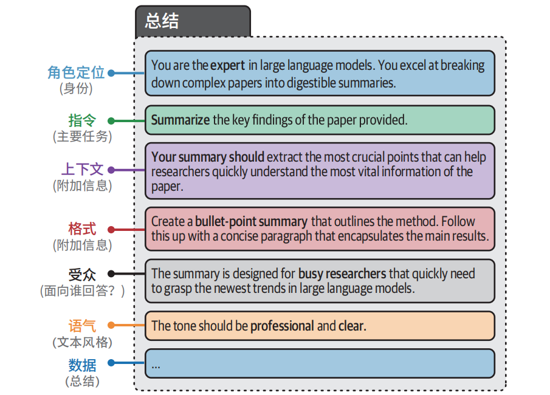
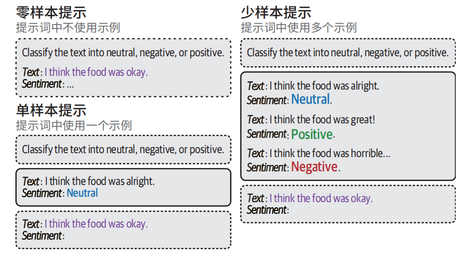
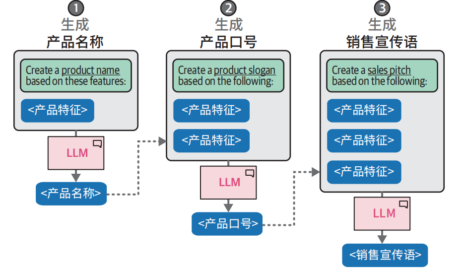
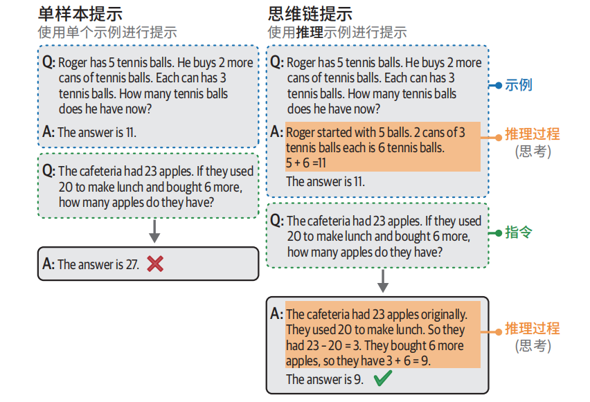
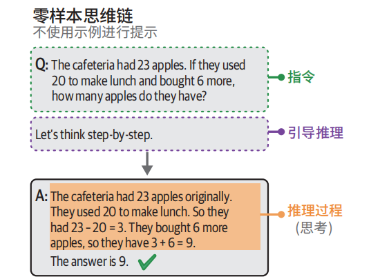
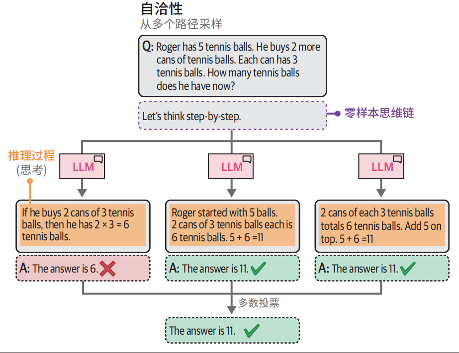
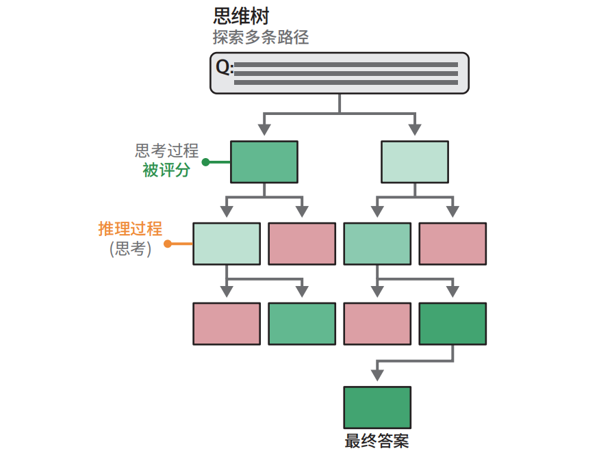
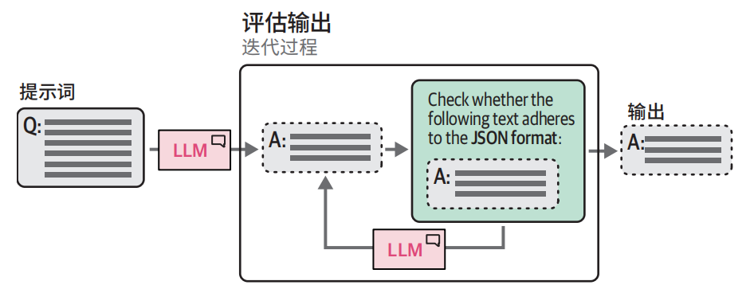
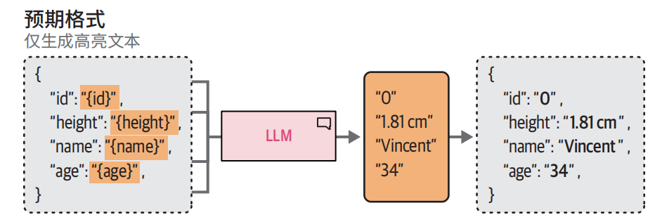

# 提示词工程

## 文本生成模型

### 如何选择模型？

我们建议从小型基础模型开始，总的来说，从小模型逐步扩展到大模型的学习体验通常比反之更顺畅。较小的模型不仅是入门的绝佳选择，还为后续进阶到更大的模型奠定了坚实的基础

### 是使用专有模型还是开源模型？

- **专有模型**通常性能更好
- **开源模型**灵活性更强、且可以免费使用

### 如何控制生成的输出？

- 提示工程

- 调整模型参数

  - temperature（温度），temperature 为 0 时每次都会生成相同的响应，因为它总是选择可能性最大的词，较高的 temperature 值允许生成可能性更小的词。

    > do_sample=False：输出具有一定的一致性，只会选择最可能的下一个词元；要开启随机性或创造性，需要设置do_sample=True

  -  top_p（采样），是一种控制 LLM 可以考虑哪些词元子集（核）的采样技术

    > 较高的 top_p 会增加生成词元的候选集合中的词元数量，反之亦然

  | 示例应用场景 | temperature | top_p | 描　　述                                                     |
  | ------------ | ----------- | ----- | ------------------------------------------------------------ |
  | 头脑风暴会议 | 高          | 高    | 高随机性输出，且可能输出的词元集合较大。生成的结果通常高度多样化，往往富有创意和出人意料 |
  | 邮件生成     | 低          | 低    | 高确定性的输出，且可能输出的词元集合较小。这会产生可预测、重点明确和保守的输出 |
  | 创意写作     | 高          | 低    | 高随机性输出，但可能输出的词元集合较小。这会产生有创意的输出，但仍保持连贯性 |
  | 翻译         | 低          | 高    | 高确定性的输出，但可能输出的词元集合较大。这会产生连贯的输出，并且具有更广泛的词汇范围，从而更具语言 |

## 提示词优化

### 使用组件

提示词通常由多个组件组成

- **角色定位：**描述 LLM 应该扮演什么角色。例如，如果你想问一个关于天体物理学的问题，可以使用"你是一位天体物理学专家"。
- **指令：**任务本身。指令应该尽可能具体，避免留下太大的解释空间。
- **上下文：**描述问题或任务背景的附加信息。它回答了"为什么提出这个指令"这样的问题。
- **格式：**LLM 输出生成文本的格式。如果不指定格式，LLM 会自行决定格式，这在自动化系统中会造成麻烦。
- **受众：**生成文本的目标对象。这也描述了输出的水平。在教育目的下，使用 ELI5（Explain like I'm 5，"向 5 岁的孩子解释"）通常很有帮助。
- **语气：**LLM 在生成文本中应该使用的语气。如果你要给老板写一封正式的邮件，你肯定不想使用非正式的语气。
- **数据：**与任务本身相关的主要数据。



> **添加/删除组件、组件顺序**都会影响 LLM 输出的质量。景寻找最佳提示词时，**实验**是至关重要的

### 提供示例

我们可以为 LLM 提供我们想要完成的目标任务的**具体示例**。这通常被称为上下文学习（incontext learning），**“一例胜千言”**。



提供示例时，我们需要区分用户（user）的问题和模型（assistant）提供的答案

```py
one_shot_prompt = [
 {
 "role": "user",
 "content": "A 'Gigamuru' is a type of Japanese musical instrument. An 
example of a sentence that uses the word Gigamuru is:"
 },
 {
 "role": "assistant",
 "content": "I have a Gigamuru that my uncle gave me as a gift. I love 
to play it at home."
 },
 {
 "role": "user",
 "content": "To 'screeg' something is to swing a sword at it. An example 
of a sentence that uses the word screeg is:"
 }
]
print(tokenizer.apply_chat_template(one_shot_prompt, tokenize=False))

# 最终生成
"During the intense duel, the knight skillfully screeged his opponent's shield, forcing him to defend himself."
```

### 分解问题

假设我们想要使用 LLM 基于一些产品特征创建产品名称、口号和销售宣传语。我们可以要求 LLM 一次性完成这些任务，但这里我们将问题分解成几个部分。



**优势：**虽然我们需要调用两次模型，但是我们可以为每次调用设置不同的参数。

**适用场景**

- **响应验证：**让 LLM 对之前生成的输出进行二次检查。
- **并行提示:**并行创建多个提示词，最后合并结果。例如，让多个 LLM 并行生成多个食谱，然后使用组合结果创建购物清单。
- **写故事：**通过将问题分解成多个组件来利用 LLM 写书或故事。比如，先写一个概要，再发展人物角色，接着构建叙事节奏，然后深入创作对话。

## 使用模型进行推理

简单来说，人类的推理方法可以分为两种思维过程。

- 方式一：自动的、直觉的、几乎即时的过程。它与自动生成词元而没有任何自我反思行为的生成模型有相似之处。
- 方式二：有意识的、缓慢的、有逻辑性的过程，类似于头脑风暴和自我反思。

使用生成模型模仿方式二，

### 思维链：先思考再回答

#### 单样本示例



```python
# 使用思维链回答
cot_prompt = [
 {"role": "user", "content": "Roger has 5 tennis balls. He buys 2 more cans 
of tennis balls. Each can has 3 tennis balls. How many tennis balls does he have 
now?"},
 {"role": "assistant", "content": "Roger started with 5 balls. 2 cans of 3 
tennis balls each is 6 tennis balls. 5 + 6 = 11. The answer is 11."},
 {"role": "user", "content": "The cafeteria had 23 apples. If they used 20 to 
make lunch and bought 6 more, how many apples do they have?"}
]
# 生成输出
outputs = pipe(cot_prompt) 
print(outputs[0]["generated_text"])
  
#最终生成
The cafeteria started with 23 apples. They used 20 apples, so they had 23 – 20 
= 3 apples left. Then they bought 6 more apples, so they now have 3 + 6 = 9 
apples. The answer is 9.
```

#### 零样本示例



```python
# 零样本思维链
zeroshot_cot_prompt = [
 {"role": "user", "content": "The cafeteria had 23 apples. If they used 20 
to make lunch and bought 6 more, how many apples do they have? Let's think 
step-by-step."}
]
# 生成输出
outputs = pipe(zeroshot_cot_prompt) 
print(outputs[0]["generated_text"])
  
#最终输出
Step 1: Start with the initial number of apples, which is 23.
Step 2: Subtract the number of apples used to make lunch, which is 20. So, 23 
- 20 = 3 apples remaining.
Step 3: Add the number of apples bought, which is 6. So, 3 + 6 = 9 apples.
The cafeteria now has 9 apples.
```

### 自洽性：采样输出

自洽性（self-consistency）：用相同的提示词向生成模型多次提问，并将占多数的结果作为最终答案。



### 思维树：探索中间步骤

思维链和自洽性，目的是实现更复杂的推理。但是都是通过从多个“思考过程”中采样，并使它们更加深入地思考，我们可以达到改进生成模型的输出的目标。这两种方法都是大模型复杂推理的简单使用方法。

**思维树：**当面对需要多个推理步骤的问题时，将其分解成多个部分，利用树状结构，对中间思考过程进行评分投票。将最有希望的思考过程保留下来。



> 写故事或提出创意构想时，这种方法非常有帮助

我们可以通过模拟多个专家之间的对话来模仿思维树的行为

```python
# 想象有三位不同的专家在解答这道题。每位专家都会先写下自己的一步思考过程，然后与小组分享。之后所有专家再继续进行下一步，以此类推。如果任何一位专家在任何环节发现自己出错，就会退出讨论。问题是：“自助餐厅原有 23 个苹果。如果用掉 20 个做午餐，又买来 6 个，现在还有多少个苹果？
zeroshot_tot_prompt = [
 {"role": "user", "content": "Imagine three different experts are answering 
this question. All experts will write down 1 step of their thinking, then share 
it with the group. Then all experts will go on to the next step, etc. If any 
expert realizes they're wrong at any point then they leave. The question is 
'The cafeteria had 23 apples. If they used 20 to make lunch and bought 6 more, 
how many apples do they have?' Make sure to discuss the results."}
]
  
  # 生成输出
outputs = pipe(zeroshot_tot_prompt) 
print(outputs[0]["generated_text"])
  
  
  # 最终输出
Expert 1: Step 1 - Start with the initial number of apples: 23 apples.
Expert 2: Step 1 - Subtract the apples used for lunch: 23 - 20 = 3 apples remaining.
Expert 3: Step 1 - Add the newly bought apples: 3 + 6 = 9 apples.
Expert 1: Step 2 - Confirm the final count: The cafeteria has 9 apples.
Expert 2: Step 2 - Review the calculations: 23 - 20 = 3, then 3 + 6 = 9. The 
calculations are correct.
Expert 3: Step 2 - Agree with the result: The cafeteria indeed has 9 apples.
All experts agree on the final count: The cafeteria has 9 apples.
```

## 输出验证

投产前对使用生成模型构建的系统和应用进行**验证尤为重要**

### 为什么要验证？

- **结构化输出：**默认情况下，大多数生成模型创建的是自由形式的文本，除了自然语言定义的结构外，不遵循特定的结构。某些用例需要其输出按特定格式（如 JSON）进行结构化。
- **输出的有效性：**即使我们允许模型生成结构化输出，它仍然可以自由生成其内容。例如，当要求模型在两个选项中输出其中之一时，它不应该创造第三个选项。
- **伦理：**一些开源生成模型没有防护机制，生成的输出没有考虑安全或伦理因素。例如，一些应用场景可能要求输出不能包含不文明用语、个人身份信息、偏见、文化刻板印象等。
- **准确性：**许多用例要求输出符合某些标准或性能，目的是仔细检查生成的信息是否事实准确、连贯、没有幻觉。

### 如何验证？

- **示例：**提供多个预期输出的示例。
- **语法：**控制词元选择过程。
- **微调：**在包含预期输出的数据上对模型进行微调。

#### 提供示例

例如：我们希望生成模型为角色扮演游戏创建角色简介

```python
# 零样本学习：不提供示例
zeroshot_prompt = [
 {"role": "user", "content": "Create a character profile for an RPG game in 
JSON format."}
]
# 生成输出
outputs = pipe(zeroshot_prompt) 
print(outputs[0]["generated_text"])

#最终输出
{
 "characterProfile": {
 "name": "Eldrin Stormbringer",
 "class": "Warlock",
 "race": "Half-Elf",
 "age": 27,
 "gender": "Male",
 "alignment": "Chaotic Good",
 "background": "Rogue",
 ...
 },
 "attributes": {
"strength": 10,
"dexterity": 17,
"constitution": 12,
"intelligence": 12,
"wisdom": 10,
"charisma":
 ...
```

我们可能不想要某些特定的属性，所以我们可以通过提供示例来完成

```python
one_shot_template = """Create a short character profile for an RPG game. Make sure 
to only use this format:
{
 "description": "A SHORT DESCRIPTION", 
 "name": "THE CHARACTER'S NAME", 
 "armor": "ONE PIECE OF ARMOR", 
 "weapon": "ONE OR MORE WEAPONS"
}
"""
one_shot_prompt = [
 {"role": "user", "content": one_shot_template}
]
# 生成输出
outputs = pipe(one_shot_prompt) 
print(outputs[0]["generated_text"])

#最终输出
{
 "description": "A cunning rogue with a mysterious past, skilled in stealth and deception.",
 "name": "Lysandra Shadowstep",
 "armor": "Leather Cloak of the Night",
 "weapon": "Dagger of Whispers, Throwing Knives"
}
```

> 该方法一个很大的缺点：我们无法明确地阻止生成某些输出。虽然我们引导模型给出指令，但它可能不会完全遵循。

#### 语法：约束采样

少样本学习有一个很大的缺点：我们无法明确地阻止生成某些输出。虽然我们引导模型并给出指令，但它可能仍然**不会完全遵循**。为此，一些用于约束和验证生成模型输出的软件包迅速面世，如 Guidance、Guardrails 和LMQL。在某种程度上，它们利用**生成模型来验证自己的输出**

**使用 LLM 检查输出是否正确遵循我们的规则：**



这种验证过程也可以用于**控制输出的格式**。



```python
import torch
del model, tokenizer, pipe
# 清空内存与显存
gc.collect() 
torch.cuda.empty_cache()

from llama_cpp.llama import Llama
# 加载Phi-3
llm = Llama.from_pretrained(
 repo_id="microsoft/Phi-3-mini-4k-instruct-gguf",
 filename="*fp16.gguf",
 n_gpu_layers=-1, 
 n_ctx=2048, 
 verbose=False
)

# 生成输出
output = llm.create_chat_completion( 
 messages=[
 {"role": "user", "content": "Create a warrior for an RPG in JSON for mat."},
 ],
 response_format={"type": "json_object"}, 
 temperature=0,
)['choices'][0]['message']["content"]

import json
# 格式化为JSON
json_output = json.dumps(json.loads(output), indent=4) 
print(json_output)


# 最终输出
{
 "name": "Eldrin Stormbringer",
 "class": "Warrior",
 "level": 10,
 "attributes": {
 "strength": 18,
 "dexterity": 12,
 "constitution": 16,
 "intelligence": 9,
 "wisdom": 14,
 "charisma": 10
 },
 "skills": {
 "melee_combat": {
 "weapon_mastery": 20,
 "armor_class": 18,
 "hit_points": 35
 },
 "defense": {
     "shield_skill": 17,
"block_chance": 90
},
"endurance": {
"health_regeneration": 2,
"stamina": 30
}
 },
 "equipment": [
{
"name": "Ironclad Armor",
"type": "Armor",
"defense_bonus": 15
},
{
"name": "Steel Greatsword",
"type": "Weapon",
"damage": 8,
"critical_chance": 20
}
 ],
 "background": "Eldrin grew up in a small village on the outskirts of a 
war-torn land. Witnessing the brutality and suffering caused by conflict, he 
dedicated his life to becoming a formidable warrior who could protect those 
unable to defend themselves."
}
```

