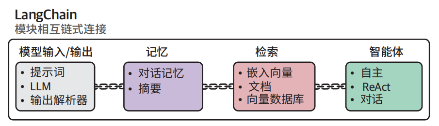
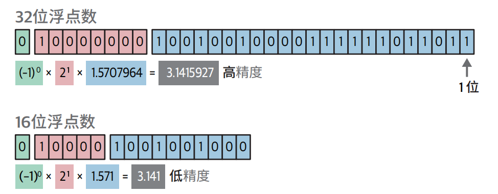
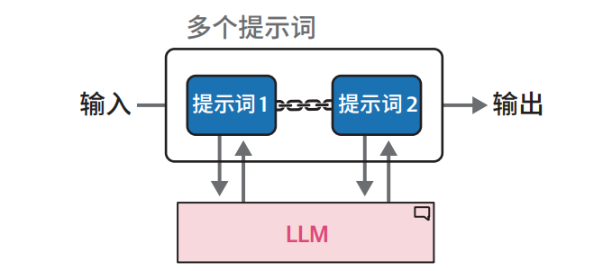
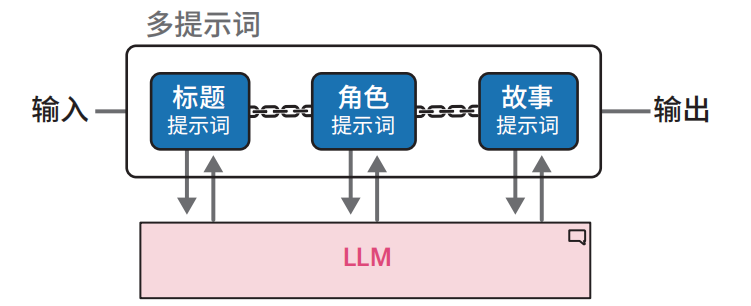
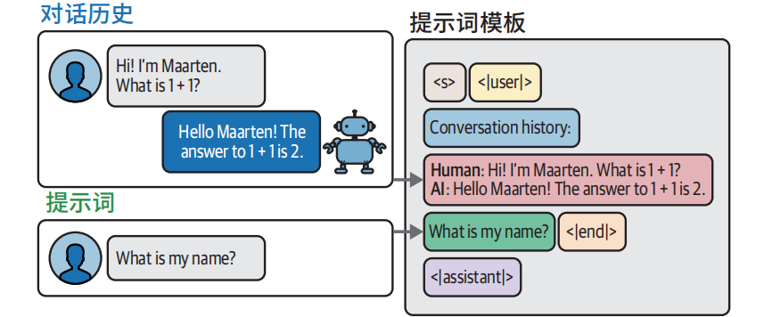
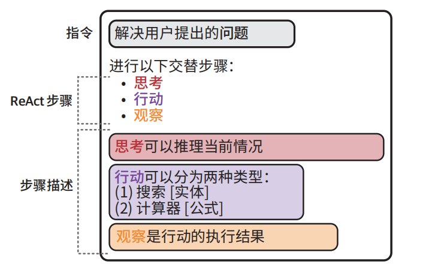

# 提升文本生成质量的方法论

- 模型输入 / 输出
- 记忆机制
- 智能体系统
- 链式架构

**LangChain 作为全功能 LLM 应用框架，其模块化组件可通过链式架构构建复杂的 LLM 系统**



## 模型输入/输出

基于LangChain加载量化模型

### 量化技术

**量化技术**通过减少表示 LLM 参数所需的位数，尽可能保留原始信息完整性的前提下实现模型压缩，程会带来轻微精度损失，但能显著提升运算速度、降低显存占用，且模型准确性与原始版本基本持平。

**用 32 位浮点数与 16 位浮点数表示圆周率的对比示例。注意当存储位数减半时数值精度显著降低**



**量化技术**旨在**准确和效率**之间取得**平衡**。比如计算圆的周长，我们常使用∏ = 3.14来计算，当然也可以使用∏ = 3.1415926... 来计算，精度越高计算越准，但是计算效率越低。

注意：

> 通常建议选择至少 4 位量化的模型，此类方案能够在压缩效率与准确率之间达到最佳平衡。尽管存在 3 位甚至 2 位的量化模型，但其性能损失较为明显，这种情况下更推荐选用高精度的更小的模型。

## 链：扩展LLM的能力

LangChain 的名称源自其核心方法之一——链（chain）。通过整合多个独立链可以用来构建复杂系统。

### 链式架构的关键节点：提示词模板

```python
from langchain import PromptTemplate
# 创建一个包含input_prompt变量的提示词模板
template = """<s><|user|>
{input_prompt}<|end|>
<|assistant|>"""
prompt = PromptTemplate( 
 template=template, 
 input_variables=["input_prompt"]
)

basic_chain = prompt | llm

# 使用链式架构
basic_chain.invoke(
 {
 "input_prompt": "Hi! My name is Maarten. What is 1 + 1?",
 }
)


# 响应
The answer to 1 + 1 is 2. It's a basic arithmetic operation where you add one 
unit to another, resulting in two units altogether.
```

### 多提示词链式架构

我们可以将复杂的提示词拆解为若干可按顺序执行的子任务。这种方法虽然需要**多次调用 LLM**，但通过使用更简单的提示词，结合中间输出，能够有效**降低系统复杂度**

**序列链式架构中，前序提示词的输出将作为后续提示词的输入**



例如：假设我们需要生成包含三个要素的故事：

• 标题

• 主要角色描述

• 故事梗概

我们采用链式架构设计，用户仅需提供初始输入，系统即可按顺序生成所有要素。该流程如下图。



```python
from langchain import LLMChain
# 创建一个链式架构来生成故事的标题
template = """<s><|user|>
Create a title for a story about {summary}. Only return the title.<|end|>
<|assistant|>"""
title_prompt = PromptTemplate(template=template, input_variables=["summary"]) 
title = LLMChain(llm=llm, prompt=title_prompt, output_key="title")

title.invoke({"summary": "a girl that lost her mother"})

# 使用故事梗概和标题创建一个链式架构来生成角色描述
template = """<s><|user|>
Describe the main character of a story about {summary} with the title {title}. 
Use only two sentences.<|end|>
<|assistant|>"""
character_prompt = PromptTemplate(
 template=template, input_variables=["summary", "title"]
)
character = LLMChain(llm=llm, prompt=character_prompt, output_key="character")

# 使用故事梗概、标题和角色描述创建一个链式架构来生成故事
template = """<s><|user|>
Create a story about {summary} with the title {title}. The main character is:
{character}. Only return the story and it cannot be longer than one paragraph.
<|end|>
<|assistant|>"""
story_prompt = PromptTemplate(
 template=template, input_variables=["summary", "title", "character"]
)
story = LLMChain(llm=llm, prompt=story_prompt, output_key="story")

# 将三个组件组合在一起，创建完整的链式架构
llm_chain = title | character | story
```

## 记忆机制

由于大模型语言都是**无状态设计**，所以它们不会主动记忆任何先前的对话内容。那如何让模型具有记忆力?

我们可以通过如下两种方式

- 对话缓冲区
- 对话摘要

### 临时记忆：对话缓冲区

通过历史对话内容唤醒其“回忆”



```python
# 创建一个包含聊天历史的新的提示词模板
template = """<s><|user|>Current conversation:{chat_history}
{input_prompt}<|end|>
<|assistant|>"""
prompt = PromptTemplate( 
 template=template,
 input_variables=["input_prompt", "chat_history"]
)

from langchain.memory import ConversationBufferMemory
# 定义要使用的记忆类型
memory = ConversationBufferMemory(memory_key="chat_history")
# 将LLM、提示词和记忆串联在一起
llm_chain = LLMChain( 
 prompt=prompt, 
 llm=llm, 
 memory=memory
)

# 生成对话并问一个简单问题
llm_chain.invoke({"input_prompt": "Hi! My name is Maarten. What is 1 + 1?"})
llm_chain.invoke({"input_prompt": "What is my name?"})
```

注意：然而随着对话轮次增加，输入提示词的文本长度会持续增长，最终可能超出模型的词元限制

> 解决办法就是仅保留最近 *k* 轮 对 话 记 录

```python
from langchain.memory import ConversationBufferWindowMemory
# 仅在记忆中保留最后两轮对话
memory = ConversationBufferWindowMemory(k=2, memory_key="chat_history")
# 将LLM、提示词和记忆串联在一起
llm_chain = LLMChain( 
 prompt=prompt, 
 llm=llm, 
 memory=memory
)
```

### 长久记忆：对话摘要

**对话摘要：**会对完整对话记录进行摘要提炼，保留核心信息。

这意味着每次向主 LLM 发起查询时，系统会执行两次模型调用：

• 用户提示词处理

• 摘要提示词生成

```python
# 创建摘要提示词模板
summary_prompt_template = """<s><|user|>Summarize the conversations and update 
with the new lines.
Current summary:
{summary}
new lines of conversation:
{new_lines}
New summary:<|end|>
<|assistant|>"""
summary_prompt = PromptTemplate( 
input_variables=["new_lines", "summary"], 
 template=summary_prompt_template
)

from langchain.memory import ConversationSummaryMemory
# 定义我们将使用的记忆类型
memory = ConversationSummaryMemory( 
 llm=llm, 
 memory_key="chat_history", 
 prompt=summary_prompt
)
# 将LLM、提示词和记忆串联在一起
llm_chain = LLMChain( 
 prompt=prompt, 
 llm=llm, 
 memory=memory
)

llm_chain.invoke({"input_prompt": "Hi! My name is Maarten. What is 1 + 1?"}) 
llm_chain.invoke({"input_prompt": "What is my name?"})
llm_chain.invoke({"input_prompt": "What was the first question I asked?"})

# 查看到目前为止的摘要内容
memory.load_memory_variables({})
```

局限：

- 原始问题信息未直接保留于聊天历史中，模型需要依赖上下文进行推测；
- 系统需要对同一 LLM 进行两次调用（分别用于响应提示词和摘要），这会增加计算时延。

> 需要在响应速度、记忆容量和准确率之间寻求平衡。

### 不同记忆类型的优缺点对比

#### **普通对话缓冲区**

> 本质：无状态模型的最朴素 “模拟有状态” 方案。

**优点**

- 最简单、最稳定
- 上下文**完整、无丢失、无变形**
- 模型理解最准

**缺点**

- 上下文长度**爆炸增长**
- 很快超过模型 `max_seq_len`（比如 4k、8k）
- token 费高、推理变慢、容易报错

#### **窗口式对话缓冲区**

**优点**

- 简单、可控、稳定
- 长度被**硬限制在 K 轮**，不会爆上下文
- 速度快、开销固定

**缺点**

- **直接丢历史，信息永久丢失**
- 早期关键信息（用户偏好、任务目标、背景）一丢就没
- 对话越长，越 “失忆”，逻辑容易断
- 只是**治标，不是治本**

> 本质：固定长度滑动窗口，暴力截断，最简单的防超限方案。

#### **对话摘要记忆**

**优点**

- 历史**不会无限变长**，长度可控
- 保留**核心信息、意图、背景**
- 适合**长对话、多轮任务、客服、助手**

**缺点**

- **摘要会丢失细节**（精确数字、时间、人名、约束条件）
- 依赖模型能力，摘要可能**跑偏、简化过度**
- 多一次模型调用，**更慢、更费 token**
- 无法还原原始对话

> 本质：用 “压缩” 替代 “截断”，保留语义，但损失精度。

#### 三者怎么选

- **短对话、任务明确、轮次少** → 普通缓冲区
- **中等对话、要稳定、不要丢最新内容** → 窗口式（最常用、最稳妥）
- **长对话、多轮、需要记住目标 / 背景** → 摘要 / 摘要 + 窗口混合

#### 混合策略（主流）

- 最近 K 轮：**保留完整原文**（保证精度）
- 更早历史：**做摘要**（保留长期记忆）

#### 业界现状

1. **ToC 聊天助手**：90% 用 **滑动窗口**（简单、稳定、成本低）
2. **ToB 任务助手 / 智能体**：主流 **混合摘要（SummaryBuffer）**

## 智能体(agent)

### 递进式推理

主流Agent都是基于ReAct （reasoning and acting）核心机制： **思考（thought/Reasoning） → 行动（acting） → 观察observation），循环执行。**

> 边思考、边行动、边迭代。

ReAct 提示词模板示例



```python
import os
from langchain_openai import 

# 使用LangChain加载OpenAI的LLM
os.environ["OPENAI_API_KEY"] = "MY_KEY"
openai_llm = ChatOpenAI(model_name="gpt-3.5-turbo", temperature=0)

# 创建ReAct模板
react_template = """Answer the following questions as best you can. You have access 
to the following tools:
{tools}
 
Use the following format:
Question: the input question you must answer 
Thought: you should always think about what to do
Action: the action to take, should be one of [{tool_names}] 
Action Input: the input to the action
Observation: the result of the action
... (this Thought/Action/Action Input/Observation can repeat N times) 
Thought: I now know the final answer
Final Answer: the final answer to the original input question 
Begin!
Question: {input}
Thought:{agent_scratchpad}"""
prompt = PromptTemplate( 
template=react_template,
 input_variables=["tools", "tool_names", "input", "agent_scratchpad"]
)

from langchain.agents import load_tools, Tool
from langchain.tools import DuckDuckGoSearchResults
# 你可以创建工具传递给智能体
search = DuckDuckGoSearchResults() 
search_tool = Tool(
 name="duckduck",
 description="A web search engine. Use this to as a search engine for gen 
eral queries.",
 func=search.run,
)
# 准备工具
tools = load_tools(["llm-math"], llm=openai_llm) 
tools.append(search_tool)


from langchain.agents import AgentExecutor, create_react_agent
# 构建ReAct智能体
agent = create_react_agent(openai_llm, tools, prompt) 
agent_executor = AgentExecutor(
 agent=agent, tools=tools, verbose=True, handle_parsing_errors=True
)

# MacBook Pro的价格是多少？
agent_executor.invoke(
 {
 "input": "What is the current price of a MacBook Pro in USD? How much 
would it cost in EUR if the exchange rate is 0.85 EUR for 1 USD."
 }
)
```

