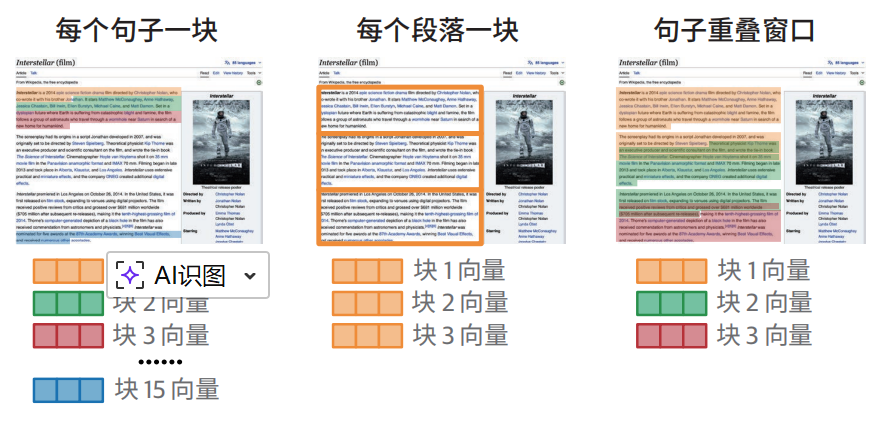
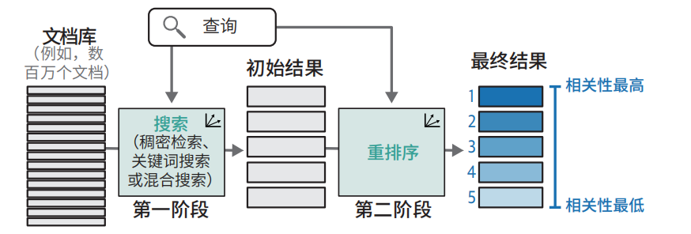
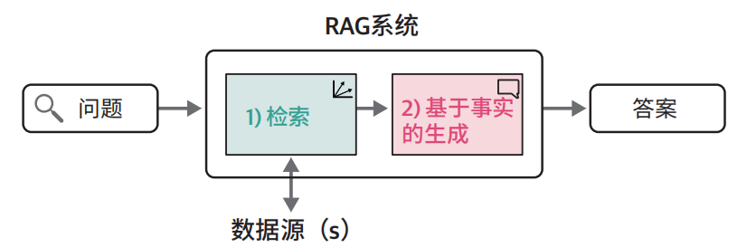
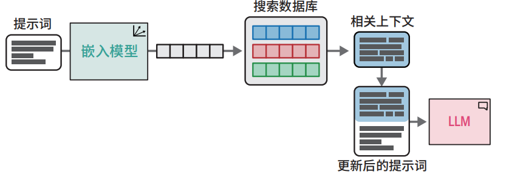

# 语义搜索与RAG

## 什么幻觉？

大模型给出错误答案就叫幻觉

### 产生幻觉的根本原因？

**大模型的训练目标**是，在当前上下问里，预测下一个概率最大的token。

- 大模型**只关心输出内容是否通顺**、想不想人说的；**不关心是不是真的**。
- 大模型**没有记忆**，他不知道的就会开始瞎编。
- 大模型是无状态的，**超出上下文长度**就会开始脑部（瞎编）。

> 模型基于语言概率生成文本，不具备事实认知、外部世界知识校验、实时信息获取能力，在信息不足或模糊时，会自动补全看似合理但虚假的内容。

### 怎么解决/减轻幻觉？

- RAG（检索增强生成）
- 调整参数：降低温度 temperature
- 强指令约束（Prompt 工程）
- 用更强的基座模型
- 事后校验（Self-Consistency / Fact Check）

## 语义搜索

从知识库中查找事实片段，所以可以避免大模型幻觉？

- 稠密检索（dense retrieval）：接受请求(Embedding)后，在文档库（Embedding Store）中通过**向量比对**，最终找出相关性最高的结果集合
- 重排序序（reranking）：对检索结果进行打分排序，将分数最高的结果放在最前面。
- RAG（Retrieval-Augmented Generation）：使用稠密检索文档片段，输入给大模型，大模型生成结果。

### 稠密检索（dense retrieval）

#### 稠密检索（dense retrieval）是如何实现语义搜索的？

稠密检索（双塔模型）是这样：

```plaintext
问题 → 向量
文档 → 向量
然后 两个向量 比一比
```

缺点

- 当文档库中完全不存在答案时，就可能出现检索内容与问题相关性不大。

  > 解决办法：
  >
  > 1. 设置最大相关性距离阈值，超出最大距离不回复
  > 2. 由用户自行判断，针对用户满意度反馈，迭代版本

- 无法精准匹配关键词（稠密检索是基于语义而不是关键词）

  > 解决办法：混合搜索（结合语义搜索与关键词搜索）

- 其训练数据之外的领域，检索性能会显著下降。

  > 解决办法：
  >
  > 1. 微调Embedding模型
  > 2. 使用专用的Embedding模型

> 向量做语义对比，词表不一样，分词不一样，模型结构不一样、训练数据不一样、权重参数不一样等等，**任意一个不一样都不行**

#### 超长文本分块嵌入策略

>  超长文本指超过模型词元限制的文本。

- 单文档单向量方案

- 单文档多向量方案

  > 1. 以句子作为独立块的处理方式可能粒度过小，导致向量无法捕捉足够的上下文信息。
  > 2. 以段落为单位进行分块是更优的选择。当文本段落较短时，这种方法效果良好；若段落较长，则建议每 3 ～ 8 个句子划分为一个块。
  > 3. 某些文本块的含义高度依赖上下文，可通过以下方式增强上下文相关性。
  >    -  在块中附加文档标题。
  >    - 引入一部分上下文内容。通过构建重叠块结构（即相邻块包含部分重复文本），可有效地保留上下文信息。



#### 最近邻搜索与向量数据库

完成查询嵌入后，要在文档种检索，我们可以使用

- 数万量级的向量：使用 NumPy 即可高效完成

- 百万量级的向量：采用 Annoy 或 FAISS 等近似最近邻（approximate nearest neighbor，ANN）搜索库进行优化检索/**向量数据库**。

  > 向量数据库：支持动态增删向量而无须重建索引，并提供向量距离之外的过滤搜索、自定义搜索等高级功能

#### 稠密检索的嵌入模型微调

微调过程的目标是使这些查询的嵌入向量更接近目标句子的嵌入向量。

微调的核心作用是拉近相关查询与文档的距离，同时推离不相关查询。

### 重排序

重排器接收搜索查询与一组搜索结果，返回按相关性优化排序的文档列表，使相关性最高的结果位于前列。



#### 重排序是如何实现语义搜索的？

用的是 **Cross-Encoder（交叉编码器）**，它把「问题」和「文档」**拼在一起** 输入模型：

```text
[CLS] 苹果的产地是哪里？ [SEP] 苹果原产于欧洲中部。 [SEP]
```

模型**直接一起看**：

- 问题在问什么
- 文档里有没有对应答案

**它是在做 “阅读理解”，不是在做 “向量比对”。**

所以它能判断：

- 有没有**关键词对应**
- 有没有**因果关系**
- 是不是在**回答问题**
- 是不是**强相关**

向量做不到的，**拼接 + 注意力机制**能做到。

### 稠密检索和重排序

**稠密检索：粗筛（快但不准）**

**重排序：精排（慢一点但极准）**

#### 为什么稠密检索快却不准呢？

它是**向量相似度**，只看**整体语义像不像**，不看**细节、关键词、逻辑、实体关系**。看着语义像 → 分数高，但**实际上答非所问** → 也会被排前面

#### 为什么重排序慢但是准呢？

不生成向量，直接看「问题」和「文本」的真实匹配度。

它会精细判断：

- 有没有**关键词**匹配
- 有没有**实体**对应
- 是不是**真的能回答问题**
- 是不是**强相关**

它的判断能力 **远强于稠密检索**。

#### 为什么不直接用重排序搜全库？

因为 **太慢、太贵、扛不住大数据量**。

- 稠密检索：毫秒级扫 100 万 条
- 重排序：1 秒只能算 50～100 条

所以：

**不能全库精排，只能先粗筛，再精排。**

#### 为什么 RAG 必须要重排序？

因为稠密检索召回的前 10 条里，可能 只有 2～3 条真有用，不重排 → 模型拿到**错误片段** → **直接产生幻觉**

> 重排序 = 给 RAG 上保险。

### 检索评估

均值平均精确率 2 （mean average precision，mAP）用来给**检索系统**打分，衡量检索模型是否准确。

> mAP越高 = 检索越准 = RAG效果越好 = 幻觉越少

它可以从多个方面进行评分比对

- Embedding模型选择是否好

- 分块策略好不好

  > 块大好，还是块小好，带不带重叠，按标题分？

- 重排序有没有用

- 混合检索有没有提升

  >  纯语义 vs 语义+ 关键字

#### 基于平均精确率的单查询评分（AP）

单查询评分 = AP（average precision） =  单个问题查询结果的平均精确率

精度 = 对的数量 ÷ 总共看到的数量

我们给个例子：

1. 对 ✅
2. 对 ✅
3. 错 ❌
4. 对 ✅
5. 错 ❌

计算 AP，按下面 4 步走：

```text
第 1 步：从上到下，一条一条看

第 2 步：每遇到一个「对的」，就记一下「当前精度」
我们一步步来：

1. 第 1 条：对 ✅

   总共看了 1 条，对 1 条

   精度 = 1/1 = 1.0
   

2. 第 2 条：对 ✅

   总共看了 2 条，对 2 条

   精度 = 2/2 = 1.0
   

3. 第 3 条：错 ❌

   不算精度，跳过

   
4. 第 4 条：对 ✅

   总共看了 4 条，对 3 条

   精度 = 3/4 = 0.75
  

5. 第 5 条：错 ❌

   跳过
  
------

第 3 步：把所有精度加起来

1.0 + 1.0 + 0.75 = 2.75

------

第 4 步：除以「总共有多少个正确答案」

这个例子里，总共有3 个正确答案。

单查询的平均精确率 AP = 2.75 ÷ 3 = 0.9167

```

#### 基于均值平均精确率的多查询评分（mAP）

多查询评分 = mAP（mean average precision） = 多个问题的AP求平均值

假设有 **3 个问题**：

1. 问题 1 → AP = 0.9
2. 问题 2 → AP = 0.8
3. 问题 3 → AP = 0.85

mAP = (0.9 + 0.8 + 0.85) ÷ 3 = **0.85**

## RAG

### 概念和原理

RAG = 检索 + 大模型生成

核心逻辑：用户问题 + 检索内容 → LLM

> 先查资料再说话 →  减少幻觉，提高准确度。




**例如：**

**用户原来的问题**：

>  苹果的产地是哪里？

**检索出来的资料**：

>  苹果原产于欧洲中部、高加索地区。

**RAG 最终发给大模型的内容**：

> 请根据以下资料回答问题：
>
> 资料：苹果原产于欧洲中部、高加索地区。
>
> 问题：苹果的产地是哪里？



### 高级RAG技术

#### 查询改写（Query Rewriting）

本质：把问题改清楚

例如：

> 用户提问：
>
> >“我们明天有一篇关于动物的作文要交。我喜欢企鹅，可以写关于企鹅的。但我也可以写海豚。它们是动物吗？也许是吧。我们写海豚吧。比如，它们生活在哪里？”
>
> 改写为查询：
>
> > “海豚生活在哪里”

作用：让检索更准，避免因为问的模糊搜不到

####  多查询 RAG（Multi-Query RAG）

本质：一个问题便多个，搜的更全；

例如：

> 用户提问：
>
> > “比较 NVIDIA 2020 年与 2023 年的财报。
>
> 做法
>
> > 查询 1：“NVIDIA 2020 年财报”
> >
> > 查询 2：“NVIDIA 2023 年财报”
>
> 然后**一起检索**，把结果合并。

作用：防止漏搜，**召回更全**。

#### 多跳 RAG（Multi-hop RAG）

本质：一步一步查，能推理

> 用户提问：
>
> > “乔布斯创立的公司发布的第一款手机是什么？”
>
> 处理流程如下
>
> > 第 1 步，乔布斯创立的公司是？→ Apple
> >
> > 第 2 步，Apple 第一款手机是？→ iPhone
>
> 多跳 RAG 会**自己拆问题、连续检索**。

作用：**能回答复杂推理问题**

#### 查询路由（Query Routing）

本质：该区哪里查就去哪里查

>你有好几个库：
>
>- 产品文档库
>- 客服知识库
>- 售后政策库
>
>用户问：
>
>> “怎么退货？”
>
>路由直接发给**售后政策库**。

作用：**不乱搜，只去对的库，速度快、精度高。**

#### 智能体 RAG（Agent + RAG）

RAG + 能思考、会规划的智能体。

它会自己：

- 判断要不要检索
- 检索几次
- 要不要查数据库
- 要不要算一算
- 最后整理答案

相当于**有脑子的 RAG**。

作用：

能做**全自动问答、任务助手**。

### RAG开发3个阶段

#### 1）入门阶段

**只做最基础的 RAG：**

- 文档分块
- Embedding 生成向量
- 向量库存储
- 稠密检索
- 丢给大模型生成答案

**目标：能跑通、能检索、能回答。**

#### 2）进阶阶段

当你发现：

- 问题问得模糊搜不到
- 检索经常漏内容
- 回答不全
- 知识库特别大

**才开始加：**

- 查询改写
- 多查询 RAG
- 重排序（这个非常实用，必加）
- 分块策略优化

这些是**性价比最高**的优化。

#### 3）高级阶段

当你要做：

- 多知识库
- 复杂推理问题
- 像人一样会思考的问答
- 企业级应用

才需要：

- 多跳 RAG
- 查询路由
- Agent + RAG

### RAG学习路线

1. 先学会：**基础 RAG**（必学）
2. 再学会：**重排序 + 分块优化**（性价比最高）
3. 再学会：**查询改写 / 多查询**（好用）
4. 最后再看：多跳、路由、Agent（了解概念就行）

### RAG效果评估

RAG 评估 = 两件事：

1. 检索准不准（检索阶段）
2. 回答对不对（生成阶段）

#### 检索阶段评估

第一步：Hit Rate

有没有搜到东西，至少搜到一个对的。

> 看系统能不能用

第二步：Recall@k

前 k 条里，有多少正确答案，看占比，看**漏不漏答案**，漏太多就要优化

- 分块
- Embedding
- 多查询/查询改写
- 混合检索

第三步：Precision@k

排在前 k 条结果，**对的占多少**。可能要翻到很后面才能找到对的

> 判断要不要加重排序

第四步：AP

找哪些问题表现的特别差，定位是分块、Embedding、还是查询问题

第五步：看mAP

给系统整体打分，对比优化前后效果

#### 生成阶段评估

**人工评估（最常用）**

- 正确性：对不对
- 完整性：全不全
- 流畅度：通顺吗
- 忠实度：有没有**瞎编（幻觉）**

**自动评估指标（简单参考）**

- **BLEU、ROUGE**：看和标准答案像不像
- **BERTScore**：看语义像不像
- **Factuality**：看有没有幻觉

#### 评估流程实操

准备一批：**问题 + 标准答案**

跑 RAG 系统

先看检索：

- **mAP** 高不高
- **Recall@5 / Recall@10** 高不高

再看回答：

- 人工抽查 50～100 条
- 看**正确率、幻觉率**

### 怎么优化RAG

**检索不行 → 加这些优化**

- 换更好的 **Embedding 模型**
- 加 **重排序 Rerank**
- 优化 **分块大小、重叠**
- 用 **混合检索**（向量 + 关键词）

**生成不行 → 加这些**

- 优化 **prompt**（让模型只看资料回答）
- 只给模型**最相关的前 3 条**
- 加 **查询改写 / 多查询**