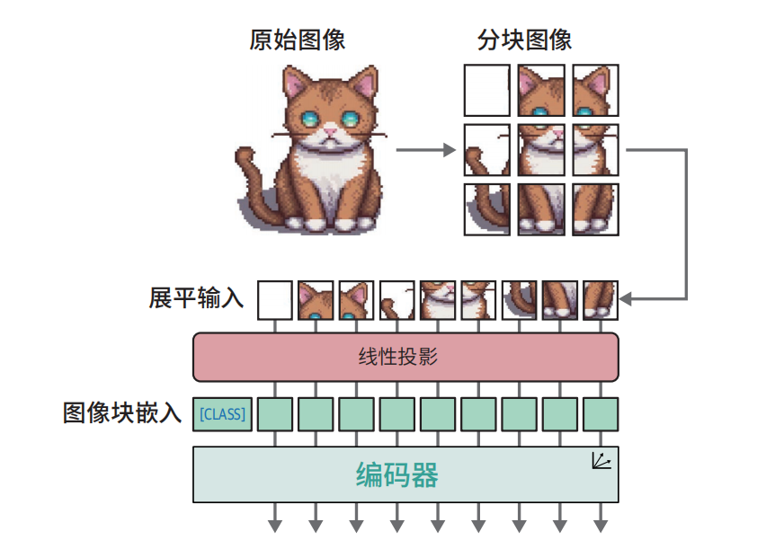
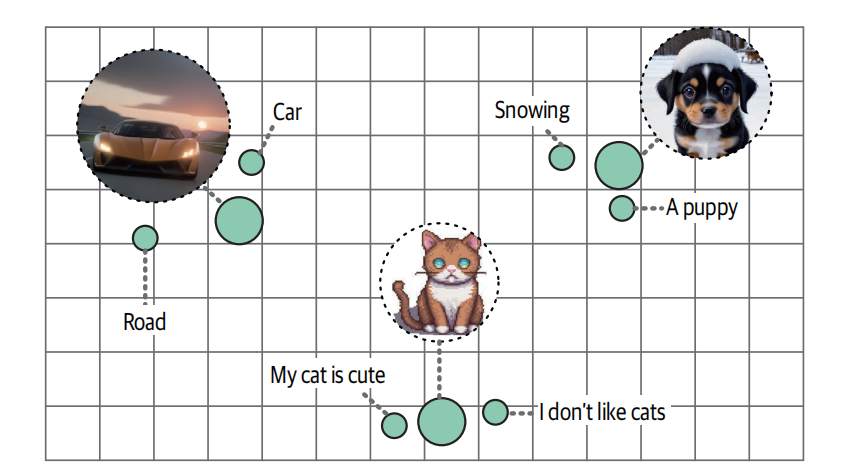
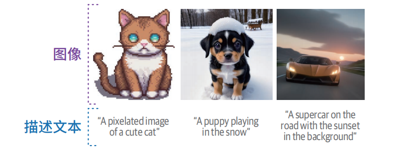
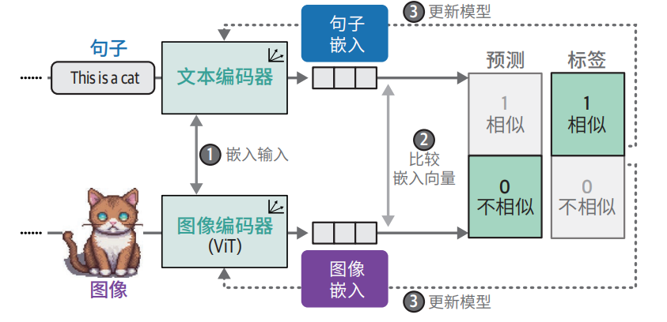

# 多模态LLM

多模态LLM = 能够同时处理多种信息的LLM，包括但不限于

- 文字
- 图片
- 语音
- 视频

## 视觉Transformer

假设有一种48*48像素的猫的图片，

```text
第一步：拆分图片（Patch）

将图片切成 16×16像素小块 → 得到 3 x 3 的9个小方块，这9个小方块 = 9个**“词元”**

第二步：每个小方块 → 变成向量（Patch Embedding）

对图像块进行嵌入操作，将其转换为嵌入向量，得到向量序列：[块1向量, 块2向量, 块3向量, 块4向量]

第三步：扔进Transformer 编码器

Self-Attention + FFN →  结合图片含义生成新的嵌入
```



## 多模态嵌入模型

### 多模态嵌入概念

把**文字、图片、语音、视频**，映射到**同一个向量空间**的嵌入模型。



### 训练数据

> 图像+ 其对应描述



### 原理

- **图片嵌入**：用 **ViT** 把图切成块 → 转成向量
- **文本嵌入**：用 **Transformer** 把文字 → 转成向量
- **对齐训练**：让 “文字猫” 和 “图片猫” 的向量**靠近**让不相关的图文**远离**



### 作用

- 搜文字出图片
- 搜图片出文字
- 给图文匹配打分，分类

> 本质是搜索 / 匹配，文本和图片都是库里面本来就存在的

## 跨越模态鸿沟（图生文/文生图）

实现架构：**视觉编码器 + Q-Former + 大预言模型LLM**

```text
[输入一张图片]
        ↓
1. 视觉编码器（ViT/CLIP，冻结）
   → 把图片切成小块 → 输出【图像特征】
        ↓
2. Q-Former（翻译官，唯一训练过的）
   → 把图像特征 → 翻译成【LLM 能听懂的视觉向量】
        ↓
3. 把【视觉向量】塞进 LLM 当作“上下文”
   同时输入你的文字问题（如：图里有什么？）
        ↓
4. LLM（冻结）
   → 看懂图 + 理解问题 → 【生成文字回答】
        ↓
[输出：这是一只小猫在睡觉……]
```

> 图片 →  视觉编码器 →  Q-Former →  LLM  →  生成文字