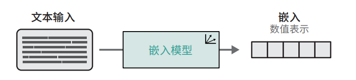
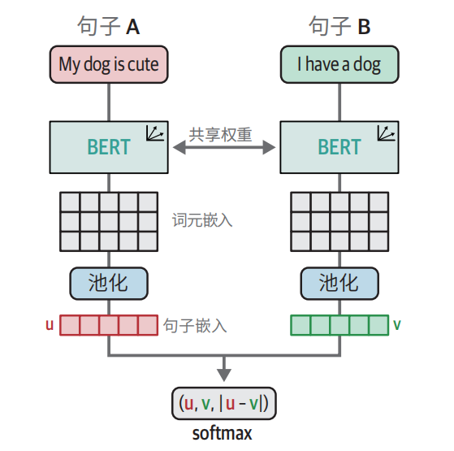
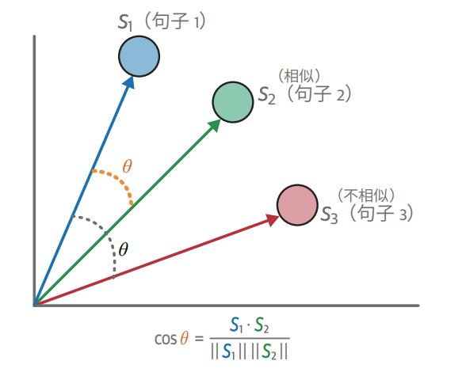
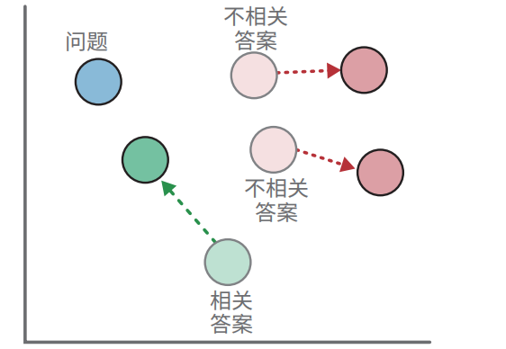
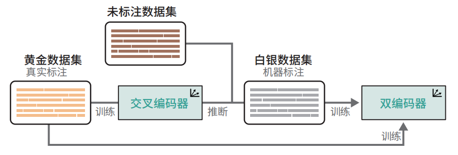
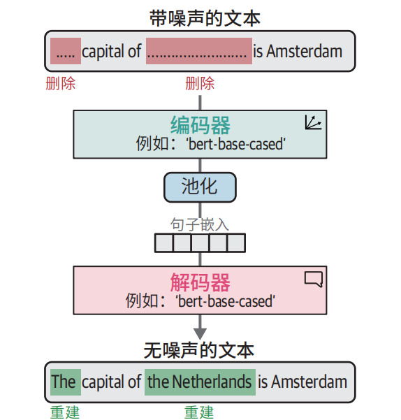

# 大模型训练和微调

## 文本嵌入模型

学生（训练模型）→  练习题（训练数据）→  学习（优化器）→  老师批改作业（损失函数）→ 期末考试（评估），通过循环这个过程可以让学生考试乘积越来越好。

### 基本概念

**嵌入：**文本  → 向量的过程

**嵌入模型：**专门做嵌入的模型



**训练目标：**让语义相近的文本向量靠近，语义无关的远离

**训练方法：**对比学习

> 假设有 3 个东西：
>
> - A：**“苹果产地”**
> - B：**“苹果原产国”**
> - C：**“今天下雨”**
>
> 对比学习的训练目标只有 2 条：
>
> 1. **让 A 和 B 靠近（正样本对）**
> 2. **让 A 和 C 远离（负样本对）**
>
> 模型一开始啥也不懂，它乱输出向量，A、B、C 离得乱七八糟。
>
> 训练时告诉模型：
>
> - **A 和 B 是一伙的 → 拉近距离**
> - **A 和 C 不是一伙的 → 推开距离**
>
> 反复这么练，最后模型就学会了：**谁和谁语义相近，谁和谁无关。**

### SBERT

SBERT = 能直接、快速、准确算出句子相似度的 BERT= 专门用来做**句子嵌入**的模型

**底层原理：**

用孪生（Siamese）BERT结构，把两句话分别编码成向量，再对比学习/相似匹配目标训练，让语义相近的句子向量靠近，最终得到高质量句子嵌入



### 训练嵌入模型

> 选底座 → 造对比数据 → 构造训练目标（对比学习） → 训练 → 评估 → 导出模型

#### 训练模型如何选？

> 训练模型 = 选基座（句子嵌入底座模型） + 微调
>
> **选底座**
>
> - 语言（中文要选中文预训练模型）
> - 大小（大模型效果好，小模型速度块）
> - 场景（RAG、检索、匹配、聚类）

##### 怎么选则训练模型

- 做中文场景：选中文预训练模型，如：BERT-base-chinese/Roberta-wwm
- 想要效果好：选 大一点的底座，如：roberta-large
- 要快、省显存、上线：选蒸馏小模型，如：DistilBERT/TinyBERT
- 要直接做语义相似度：选 已经训好的 SBERT

#### 训练数据哪里来？

> 训练数据 = 对比数据

##### 训练数据长什么样？

格式1：句子对

```text
(“苹果产地是哪里”, “苹果原产国是哪里”, 1)
(“苹果产地是哪里”, “今天天气不错”, 0)
```

格式2：三元组（Triplet）

```text
(
  "苹果产地是哪里",   # 锚点
  "苹果原产于哪里",   # 正样本
  "今天天气不错"      # 负样本
)
```

##### 训练数据怎么来？

- 用已有的标注数据

- 大模型辅助生成

  >直接让 GPT / 文心 / 豆包 生成：
  >
  >> 给我 5 句和 “苹果产地是哪里” 意思一样的话
  >>
  >> 再给我 5 句看起来像但不一样的话
  >
  >批量生成 **正样本对 + 三元组**。

#### 深入评估

STSB = 测嵌入模型核心能力（自己训练出来的） = **语义相似度高不高**

MTEB = 全面权威测试（包含STSB测试内容） = 反映嵌入模型的综合能力（语义相似度、检索、聚类、分类、重排序等等）

GLUE = 测试嵌入模型基座的综合能力（别人训练出来的）

#### 损失函数

损失函数 = 衡量模型错的有多严重

作用：告诉模型哪里错了，该怎么改才能让模型越来越准

-  **余弦相似度损失函数**：主要用来判断语义相似度，不相似就损失大，相似损失小，使相似的更靠近，不相似的远离。

  

- **多负例排序损失函数**：主要用于检索，正确答案相似度应是第一，不是第一就否则损失大

  

### 微调嵌入模型

在已训练好的模型上进行微调（而不是在基座上训练）

训练模型和微调模型的异同

|              | 起点不一样                  | 目的不一样               | 难度/数据量不一样        |
| ------------ | --------------------------- | ------------------------ | ------------------------ |
| 训练模型     | 基座（BERT/RoBERTa）        | 学会做向量               | 数据多、训练久、从头学   |
| **微调模型** | 已训练好的嵌入模型（SBERT） | 让嵌入模型更适配专业数据 | 数据少、训练快、小修小补 |

#### 增强型SBERT

1. 使用小型标注数据集（黄金数据集）微调交叉编码器（BERT）；
2. 创建新的句子对；
3. 使用微调后的交叉编码器标注新的句子对（白银数据集）；
4. 在扩展数据集（黄金数据集 + 白银数据集）上训练双编码器（SBERT）。



> 交叉编码器（极慢、精度极高）喂黄金数据（质量很高、数量很少、也很贵）
>
> 双编码器（速度快，精度没那么高）喂白银数据（机器标注，质量没那么高，数量多，不贵） + 黄金数据


**怎么使用黄金数据生成白银数据？**

1. 手里只有【黄金数据】

   > 人工标注、质量很高、数量很少、也很贵、不足以训好模型

   ```text
   (句子A, 句子B, 相似=1)
   (句子C, 句子D, 相似=0)
   ...
   只有几百对
   ```

2. 用黄金数据训练一个【交叉编码器】

   > 交叉编码器 = **专门判断两句话像不像的模型**

   - 精度极高

   - 速度极慢

   - **只能用来打分，不能用来检索**

   训练完后，它变成了你领域的**自动标注专家**。

3. 准备一大堆【无标注的原始句子】

   不需要标注！

   只要一堆**纯文本句子**，比如你业务里的：

   - 问题
   - 文档片段
   - 客服对话
   - 文章句子

   数量可以是：**1 万、10 万、100 万都行**，例如

   ```text
   句子1: 苹果的产地是哪里
   句子2: 苹果原产于哪个国家
   句子3: 西瓜怎么挑
   句子4: 明天会下雨吗
   ...
   ```

4. 批量造句子对

   随便两两组合，瞬间造出：几万～几十万对

   ```text
   (句子1, 句子2)
   (句子1, 句子3)
   (句子1, 句子4)
   (句子2, 句子3)
   ...
   ```

5. 让交叉编码器给这些句子对【自动打分】

   把每一对扔给训练好的交叉编码器，它会输出分数：

   ```text
   (句子1, 句子2) → 0.98 → 很像
   (句子1, 句子3) → 0.12 → 不像
   (句子1, 句子4) → 0.05 → 不像
   ```

6. 按分数阈值【自动贴标签】,得到【白银数据集】

   你设定一个简单规则：

   - **分数 ≥ 0.85 → 标记为相似对（正样本 label=1）**
   - **分数 ≤ 0.2 → 标记为不相似对（负样本 label=0）**
   - 中间分数丢掉不要

   这样你就得到了：

   ```text
   (句子1, 句子2, 1)
   (句子1, 句子3, 0)
   (句子1, 句子4, 0)
   ...
   ```

   这些【模型自动标注的数据】

   就叫 【白银数据集】

7. 黄金 + 白银混合 → 训练 SBERT（双编码器）

   - 黄金数据：几百条
   - 白银数据：几万～几十万条

   一混合，训出来的 SBERT 效果**强一大截**。

### 无监督学习

> 如果没有黄金数据、没有对比数据、只有一堆乱七八糟的文本，该怎么训练模型？ ——无监督学习

TSDAE是一种非常优雅的通过无监督学习创建嵌入模型的方法。

核心思想：把句子破环  → 让模型还原  → 在还原的过程中，学会句子的语义  →  最后得到好的句子嵌入。

**TSADE到底如何工作？**

1. 拿一个正常句子

   > 比如：苹果的原产地是欧洲

2. 把句子破环

   两种破环句子的方法

   - 随机删掉一些词

     > 苹果 原产地（删词）

   - 随机打乱次的顺序

     > 苹果 欧洲 原产地（乱序）

3. 让模型**去还原句子**

   > 输入：苹果 欧洲 原产地
   >
   > 模型努力输出：苹果的原产地是欧洲

4. 模型为了还原成功，必须理解句子的意思、结构、语义。

5. 训练完后，模型的**编码器部分**，就变成了一个**很强的句子嵌入模型**。




**使用TSDAE进行领域适配**

> 无监督学习表现通常不如监督学习，而且难以学习特定领域的概念

领域适配（domain adaptation）：将**全科目都懂一点的大模型训练成一个专科专精模型**

**领域适配怎么做？**

1. 收集领域内大量无标注文本
2. 用 **TSDAE、对比学习** 等方法
3. 在**通用模型基础上再训练一遍**
4. 模型就变成**领域专用模型**

> 如果无监督学习使用的是领域内的无标注文本，那么就不用做领域适配了。
