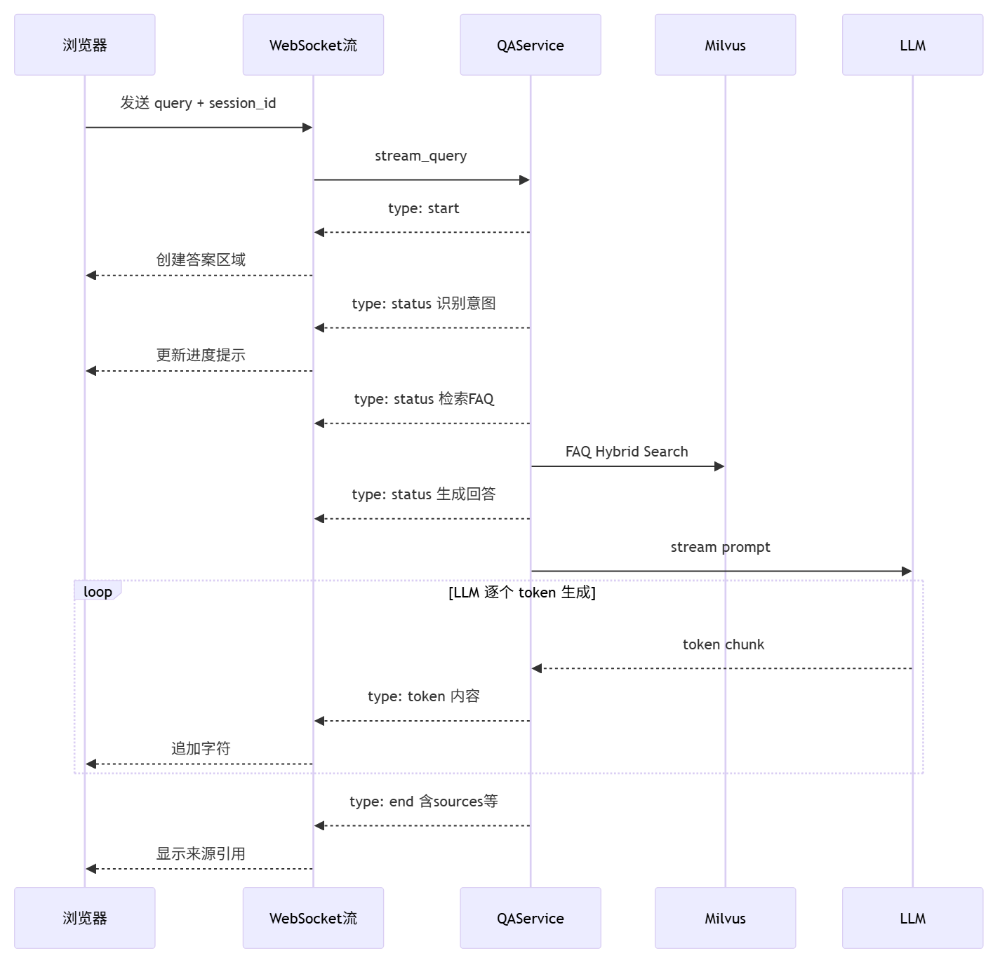

# FastAPI 基础

## 最小 FastAPI 应用

```python
from fastapi import FastAPI

app = FastAPI(title="我的 API")

@app.get("/hello")
async def hello():
    return {"message": "Hello World"}

@app.get("/items/{item_id}")
async def read_item(item_id: int, q: str = None):
    return {"item_id": item_id, "q": q}

# 运行：uvicorn main:app --reload
```

## 路由（Router）

### 路由创建

```python
# qa_core/api/chat.py
from fastapi import APIRouter
router = APIRouter()

@router.websocket("/api/stream")
async def websocket_endpoint(websocket: WebSocket):
    ...

@router.get("/api/history/{session_id}")
async def get_history(session_id: str):

```

### 路由注册

```python
# app.py — 注册路由
from qa_core.api import chat, admin, pages, kb_versions

app.include_router(pages.router)
app.include_router(chat.router)
app.include_router(admin.router)
app.include_router(kb_versions.router)
```

## Pydantic 数据校验

```python
from pydantic import BaseModel, Field

class RetrievalDebugRequest(BaseModel):
    """POST /api/retrieval/debug 的请求体。"""

    query: str = Field(..., min_length=1)
    session_id: str | None = None
    scenario_id: str | None = None
    source_filter: str | None = None
    tenant_id: str | None = None
    dataset_id: str | None = None
    visibility: str | None = None
    user_role: str | None = None
    user_roles: list[str] = Field(default_factory=list)
    kb_version: str | None = None

# FastAPI 会自动：
# 1. 检查 query 最短为 1 个字符
# 2. 把 JSON 中的字段映射到对象属性
# 3. 如果缺少必填字段或类型不对，返回 422 错误（附带清晰的错误信息）
```

## 跨域请求(CORS) 

```python
from fastapi.middleware.cors import CORSMiddleware

app.add_middleware(
    CORSMiddleware,
    allow_origins=settings.cors_allow_origins,
    allow_credentials=True,
    allow_methods=["GET", "POST", "DELETE", "OPTIONS"],
    allow_headers=["*"],
)
```

## 启动事件与依赖注入

```python
# 启动事件：服务启动时执行一次
@app.on_event("startup")
async def warmup_runtime():
    validate_runtime_environment()  # 校验环境
    await asyncio.to_thread(warmup_retrieval_stack)  # 预热模型

# 依赖注入：在路由函数执行前注入共享资源
from fastapi import Depends

def require_admin_token(x_admin_token: str | None = Header(default=None)) -> None:
    ...

@router.get("/api/admin/langsmith")
async def get_langsmith_status(_=Depends(require_admin_token)):
    ...
```

## WebSocket 实现流式问答

```python
# qa_core/api/chat.py — 简化的 WebSocket 流式问答

@router.websocket("/api/stream")
async def websocket_endpoint(websocket: WebSocket):
    await websocket.accept()  # 接受连接

    try:
        raw_data = await websocket.receive_text()  # 接收原始 JSON 字符串
        data = json.loads(raw_data)  # 手动解析 JSON
        service = get_qa_service()

        # stream_query 返回一个同步 Generator
        # asyncio.to_thread 把它放到线程池中执行
        # 每次 yield 生成一个事件，我们通过 WebSocket 发送
        generator = await asyncio.to_thread(
            lambda: service.stream_query(
                query=data["query"],
                session_id=data.get("session_id"),
                ...
            )
        )

        for event in generator:
            await websocket.send_json(event)  # 推送事件给前端

    except WebSocketDisconnect:
        pass  # 用户关闭页面，正常处理
```

通过 Generator 产出不同事件



```text
{"type": "start", "session_id": "..."} # ↓ 告知前端：请求已接收，准备展示答案区域

{"type": "status", "message": "正在识别问题意图..."} # ↓ 告知前端：当前进行到哪一步了

{"type": "token", "content": "入职"} {"type": "token", "content": "流程"} {"type": "token", "content": "包括"} # ↓ 逐字推送，前端实时渲染

{"type": "end", "sources": [...], "intent": {...}, "retrieval": {...}} # ↓ 告知前端：回答完毕，附带来源引用和诊断信息
```

设计要点

```python
**设计要点**：
- `status` 事件让用户知道系统在做什么，不是卡住了
- `token` 事件让答案逐步出现，体验类似 ChatGPT
- `end` 事件携带诊断信息，方便前端展示"参考来源 X 条"、命中路径、耗时等

### 3.5 为什么用同步 Generator 而非异步 Generator

```python
# 本项目使用同步 Generator
def stream_query(...) -> Generator[dict, None, None]:
    yield {"type": "status", ...}
    # Milvus 检索（同步）
    # LLM 流式调用（同步）
    yield {"type": "token", ...}

# FastAPI 层用 asyncio.to_thread 包裹
generator = await asyncio.to_thread(lambda: service.stream_query(...))
```

