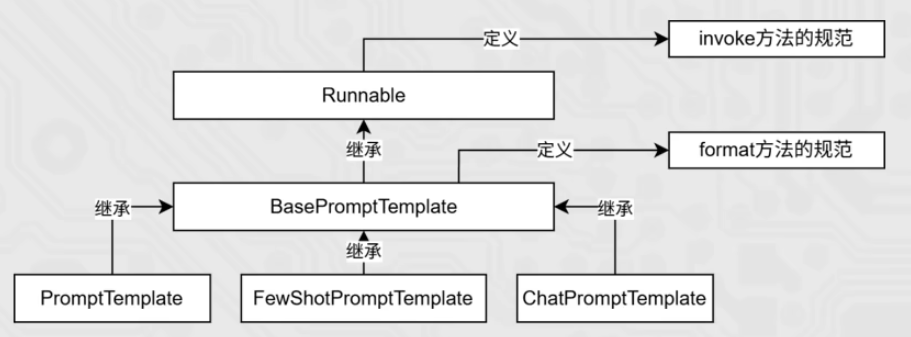

# langchain生态系统

## 模型接入

### `ChatOpenAI` 

调用商用大模型接口

```PYTHON
from dotenv import load_dotenv
from langchain_core.messages import SystemMessage, HumanMessage
from langchain_ollama import OllamaLLM, ChatOllama, OllamaEmbeddings
from langchain_openai import ChatOpenAI
import os

load_dotenv()

def demo01():
    # 通过OpenAI兼容接口调用商用大模型接口（deepseek、qwen）
    """
    model: 模型名称
    temperature: 采样温度
    openai_api_key: 密钥
    base_url: 接口地址
    max_token: 最大token数
    :return:
    """
    model = ChatOpenAI(model=os.getenv("MODEL"),
                       base_url=os.getenv("BASE_URL"),
                       openai_api_key=os.getenv("OPENAI_API_KEY"),
                       temperature=0.7,
                       max_tokens=1024)

    prompt = "给我讲个笑话，100字？"
    result = model.invoke(prompt)
    print(result)
```

### `OllamaLLM`

调用本地部署大模型

```python
def demo02():
    model = OllamaLLM(model=os.getenv("LOCAL_MODEL"),
                      base_url=os.getenv("LOCAL_URL"),
                      temperature=0.7,
                      max_tokens=1024)

    prompt = "给我讲个笑话，100字？"
    result = model.invoke(prompt)
    print(result)
```

### `ChatOllama`

调用本地部署大模型实现多角色对话

```python
def demo03():
    model = ChatOllama(model=os.getenv("LOCAL_MODEL"),
                       base_url=os.getenv("LOCAL_URL"),
                       temperature=0.7,
                       max_tokens=1024)

    message = [
        SystemMessage(content="你是一个著名的诗人。"),
        HumanMessage(content="帮我写一首唐诗")
    ]
    result = model.invoke(message)
    print(result)
```

### `OllamaEmbedding`

调用本地部署的`Embedding`模型

```python
def demo04():
    model = OllamaEmbeddings(model=os.getenv("EMBEDDING_MODEL"))
    # 单独嵌入
    r = model.embed_query("你好")
    print(f'r : {r}')

    # 批量嵌入
    r2 = model.embed_documents(["你好", "世界"])
    print(f'r2 : {r2}')
```

## 模型交互

### invoke

单个输入 -> 完整输出（同步）

```python
def demo01():
    """
    单次调用
    :return:
    """
    model = ChatOpenAI(model=os.getenv("MODEL"),
                       base_url=os.getenv("BASE_URL"),
                       openai_api_key=os.getenv("OPENAI_API_KEY"),
                       temperature=0.7,
                       max_tokens=1024)

    prompt = "给我讲个笑话，100字？"
    result = model.invoke(prompt)
    print(result)
```

### stream

单个输入 -> 逐token流式输出（异步）

```python
def demo02():
    """
    流式输出
    :return:
    """
    model = ChatOpenAI(model=os.getenv("MODEL"),
                       base_url=os.getenv("BASE_URL"),
                       openai_api_key=os.getenv("OPENAI_API_KEY"),
                       temperature=0.7,
                       max_tokens=1024)

    # prompt = "给我讲个笑话，200个字"
    # message = [HumanMessage(content=prompt)]

    prompt = "给我讲个笑话，200个字"
    result = model.stream(prompt)
    for chunk in result:
        print(chunk.content, end="", flush=True)
```

### batch

多个输入 -> 多个完整输出（同步）

```python
def demo03():
    """
    批量处理
    :return:
    """
    model = ChatOpenAI(model=os.getenv("MODEL"),
                       base_url=os.getenv("BASE_URL"),
                       openai_api_key=os.getenv("OPENAI_API_KEY"),
                       temperature=0.7,
                       max_tokens=1024)

    prompts = ["给我讲个笑话", "你是谁"]
    result = model.batch(prompts)

    # msg1 = [HumanMessage(content="给我讲个笑话")]
    # msg2 = [HumanMessage(content="你是谁")]
    # result = model.batch([msg1, msg2])
    print(result)
```

## 模型封装

因为项目中存在多次调用模型的场景，为了使用方便需要将模型的实例定义为公共函数使用，为了提高性能减少资源浪费，使用`@lru_cache`进行缓存（2个实例）

```python
"""
@lru_cache 是一个缓存机制（装饰器），可以将实例进行缓存，避免创建相同参数的多个实例，节省资源
"""
from functools import lru_cache


@lru_cache
def slow_add(a, b):
    """
    适用场景：
    1：创建示例对象（参数相对固定的情况）
    2：每次参数不同缓存的结果也不同，当传递的参数变化很大的情况，缓存会一直膨胀
    """
    print(f"计算结果: {a} + {b} = {a + b}")
    return a + b


slow_add(1, 2)
slow_add(2, 3)
slow_add(2, 3)
```

## 消息类型

`SystemMessage`, `HumanMessage`, `AIMessage`

```python
from langchain_openai import ChatOpenAI
from langchain_core.messages import SystemMessage, HumanMessage, AIMessage

# 初始化模型
model = ChatOpenAI(model=os.getenv("MODEL"),
                   base_url=os.getenv("BASE_URL"),
                   openai_api_key=os.getenv("OPENAI_API_KEY"),
                   temperature=0.7,
                   max_tokens=1024)

# 构建完整对话历史
messages = [
    SystemMessage(content="你是一个AI助手，回答要简洁明了。"),
    HumanMessage(content="1+1等于几？"),
    AIMessage(content="1+1等于2。"),  # 模拟上一轮AI回复
    HumanMessage(content="那2+2呢？")
]

# 调用模型（基于历史对话继续回答）
response = model.invoke(messages)

print("AI回复：", response.content)
print("当前AI消息类型：", type(response))
```

## 提示词模板

### `PromptTemplate`

> 普通提示词模板，zero-shot

写法一

```python
def demo01():

    # 1. 定义 Prompt 模板
    prompt_template = PromptTemplate.from_template(
        "我的邻居姓{lastname}, 刚生了{gender}, 你帮我起个名字, 简单回答。"
    )

    prompt_text = prompt_template.format(lastname="张", gender="女儿")
    res = model.invoke(input=prompt_text)
    print(res)
```

### `FewShotPromptTemplate`

> 少样本提示词模板

```python
def demo02():
    # 定义示例模板
    example_template = PromptTemplate.from_template("单词:{word}, 反义词:{antonym}")

    # 示例数据（列表嵌套字典）
    example_data = [
        {"word": "大", "antonym": "小"},
        {"word": "上", "antonym": "下"}
    ]

    # 构建少样本提示词模板
    few_shot_prompt = FewShotPromptTemplate(
        example_prompt=example_template,
        examples=example_data,
        prefix="给出给定词的反义词，有如下示例：",
        suffix="基于示例告诉我：{input_word}的反义词是？",
        input_variables=['input_word']
    )

    # 生成最终提示词
    prompt_text = few_shot_prompt.invoke(input={"input_word": "左"}).to_string()
    print(prompt_text)
```

输出

```text
给出给定词的反义词，有如下示例：

单词:大, 反义词:小

单词:上, 反义词:下

基于示例告诉我：左的反义词是？
```

### format 和 invoke 的区别



format 是  `BasePromptTemplate` 定义的方法，invoke 是 `Runnable` 定义的方法 

| 区别   | format                             | invoke                                                    |
| ------ | ---------------------------------- | --------------------------------------------------------- |
| 功能   | 纯字符串替换，解析占位符生成提示词 | Runnable 接口标准方法，解析占位符生成提示词               |
| 返回值 | 字符串                             | `PromptValue` 类对象                                      |
| 传参   | `.format(k=v, k=v, ...)`           | `.invoke({"k":v, "k":v, ...})`                            |
| 解析   | 支持解析 `{}` 占位符               | 支持解析 `{}` 占位符和 `MessagesPlaceholder` 结构化占位符 |

```python
template = PromptTemplate.from_template("我的邻居是：{lastname}，最喜欢：{hobby}")

res = template.format(lastname="张大明", hobby="钓鱼")
print(res, type(res))

res2 = template.invoke({"lastname": "周杰伦", "hobby": "唱歌"})
print(res2, type(res2))
```

输出

```text
我的邻居是：张大明，最喜欢：钓鱼 <class 'str'>
text='我的邻居是：周杰伦，最喜欢：唱歌' <class 'langchain_core.prompt_values.StringPromptValue'>

```

### `ChatPromptTemplate`

> 多角色消息模板 + 动态消息列表

```python
def demo03():
    chat_prompt_template = ChatPromptTemplate.from_messages(
        [
            ("system", "你是一个边塞诗人，可以作诗。"),
            MessagesPlaceholder("history"),
            ("human", "请再来一首唐诗"),
        ]
    )

    history_data = [
        ("human", "你来写一个唐诗"),
        ("ai", "床前明月光，疑是地上霜，举头望明月，低头思故乡"),
        ("human", "好诗再来一个"),
        ("ai", "锄禾日当午，汗滴禾下锄，谁知盘中餐，粒粒皆辛苦"),
    ]

    # StringPromptValue    to_string()
    prompt_text = chat_prompt_template.invoke({"history": history_data}).to_string()

    print(prompt_text)def demo03():
    chat_prompt_template = ChatPromptTemplate.from_messages(
        [
            ("system", "你是一个边塞诗人，可以作诗。"),
            MessagesPlaceholder("history"),
            ("human", "请再来一首唐诗"),
        ]
    )

    history_data = [
        ("human", "你来写一个唐诗"),
        ("ai", "床前明月光，疑是地上霜，举头望明月，低头思故乡"),
        ("human", "好诗再来一个"),
        ("ai", "锄禾日当午，汗滴禾下锄，谁知盘中餐，粒粒皆辛苦"),
    ]

    # StringPromptValue    to_string()
    prompt_text = chat_prompt_template.invoke({"history": history_data}).to_string()

    print(prompt_text)
```

### 使用`vars()`注入对象属性

> vars() 函数：将对象转换为字典后再解包，更加明确和安全

```python
    class Person:
        def __init__(self, lastname, hobby):
            self.lastname = lastname
            self.hobby = hobby

    person = Person("张三", "看电影")

    template = PromptTemplate.from_template("我的邻居是：{lastname}，最喜欢：{hobby}")

    res = template.format(**vars(person))
    print(res, type(res))

    res2 = template.invoke(vars(person))
    print(res2, type(res2))
```

## 链式调用

> 核心前提：即Runnable子类对象才能入链

```python
def demo01():
    """
    单链
    :return:
    """
    chat_prompt_template = ChatPromptTemplate.from_messages(
        [
            ("system", "你是一个边塞诗人，可以作诗。"),
            MessagesPlaceholder("history"),
            ("human", "请再来一首唐诗"),
        ]
    )

    history_data = [
        ("human", "你来写一个唐诗"),
        ("ai", "床前明月光，疑是地上霜，举头望明月，低头思故乡"),
        ("human", "好诗再来一个"),
        ("ai", "锄禾日当午，汗滴禾下锄，谁知盘中餐，粒粒皆辛苦"),
    ]

    model = OllamaLLM(model="qwen2:0.5B")

    # 组成链，要求每一个组件都是Runnable接口的子类
    chain = chat_prompt_template | model

    # 使用invoke
    res = chain.invoke({"history": history_data})
    print(res)
    
    # 使用stream
    for chunk in chain.stream({"history": history_data}):
        print(chunk, end="", flush=True)
```

## 模型输出

### `StrOutputParser`

```python
def demo02():
    parser = StrOutputParser()
    model = OllamaLLM(model="qwen2.5:7B")
    prompt = PromptTemplate.from_template(
        "我姓居姓：{lastname}，刚生了{gender}，请起名，仅告知我名字无需其它内容。"
    )

    chain = prompt | model | parser

    res = chain.invoke({"lastname": "张", "gender": "女儿"})
    print(res)
```

### `JsonOutputParser`

> `JsonOutputParser` + 多步执行链，需要提示词中明确返回`JSON`格式，最好配合少样本使用

```python
def demo02():
    # 创建所需的解析器
    str_parser = StrOutputParser()
    json_parser = JsonOutputParser()

    # 模型创建
    model = ChatTongyi(model="qwen3-max")

    # 第一个提示词模板
    first_prompt = PromptTemplate.from_template(
        "我姓居姓：{lastname}，刚生了{gender}，请帮忙起名字，"
        "并封装为JSON格式返回给我。要求key是name，value就是你起的名字，请严格遵守格式要求。"
    )

    # 第二个提示词模板
    second_prompt = PromptTemplate.from_template(
        "姓名：{name}，请帮我解析含义。"
    )

    # 构造链
    chain = first_prompt | model | json_parser | second_prompt | model | str_parser

    res = chain.stream({"lastname": "张", "gender": "女儿"})

    for chunk in res:
        print(chunk)
```

### 自定义函数

> 简单快捷，返回一个字段，快速实现

```python
def demo03():
    str_parser = StrOutputParser()
    # 第一个提示词模板
    first_prompt = PromptTemplate.from_template(
        "我姓居姓：{lastname}，刚生了{gender}，请帮忙起名字，仅告诉我名字，不要额外信息"
    )

    # 第二个提示词模板
    second_prompt = PromptTemplate.from_template(
        "姓名：{name}，请帮我解析含义。"
    )

    # 模型创建
    model = ChatTongyi(model="qwen3-max")
    
	# 函数的入参：AIMessage -> dict  ({"name": "xxx"})
    # my_func = RunnableLambda(lambda ai_msg: {"name": ai_msg.content})
    my_fun = RunnableLambda(lambda ai_msg: {'name': ai_msg.content})

    # 构造链
    chain = first_prompt | model | my_fun | second_prompt | model | str_parser

    res = chain.stream({"lastname": "张", "gender": "女儿"})

    for chunk in res:
        print(chunk)
```

### `with_structured_output + Pydantic` 模型

> 复杂实体抽取，封装为自定义`Pydantic`对象，常用于意图识别

#### 意图识别

```python
from pydantic import BaseModel, Field
from typing import Literal

# 定义输出结构
class IntentLLMDecision(BaseModel):
    intent: Literal["GREETING", "FAQ_QUERY", "KNOWLEDGE_QUERY",
                    "FOLLOW_UP", "HUMAN_SERVICE", "OUT_OF_SCOPE"]  # 意图分类
    confidence: float = Field(default=0.6, ge=0.0, le=1.0)  # 置信度范围0~1之间
    reason: str = Field(default="")  # 理由

# 创建带结构化输出的模型
model = get_chat_model(streaming=False)
structured_model = model.with_structured_output(IntentLLMDecision)

# 调用 — 返回值是 Pydantic 对象，不是字符串
decision = structured_model.invoke([
    SystemMessage(content="你是意图识别助手..."),
    HumanMessage(content="用户问：入职流程有哪些步骤？"),
])

print(decision.intent)      # "KNOWLEDGE_QUERY"
print(decision.confidence)  # 0.85
print(decision.reason)      # "用户询问企业流程制度类问题"
```

#### 封装自定义`Pydantic`对象

```python
def demo04():
    model = ChatTongyi(model="qwen3-max")

    class NameResult(BaseModel):
        name: str = Field(description="起好的姓名")
        meaning: str = Field(description="姓名含义")

    structured_model = model.with_structured_output(NameResult)

    prompt = PromptTemplate.from_template(
        "我姓：{lastname}，刚生了{gender}，请起一个名字，并解释含义。"
    )

    chain = prompt | structured_model

    res = chain.invoke({
        "lastname": "张",
        "gender": "女儿",
    })
    print(res)
    print(type(res))
```

#### 多步执行链

```python
def demo04():
    model = ChatTongyi(model="qwen3-max")

    class NameResult(BaseModel):
        name: str = Field(description="起好的姓名")
        meaning: str = Field(description="姓名含义")

    structured_model = model.with_structured_output(NameResult)

    # 第一个提示词模板
    first_prompt = PromptTemplate.from_template(
        "我姓居姓：{lastname}，刚生了{gender}，请帮忙起名字，仅告诉我名字，不要额外信息"
    )

    # 第二个提示词模板
    second_prompt = PromptTemplate.from_template(
        "姓名：{name}，请帮我解析含义。"
    )

    chain = first_prompt | structured_model | second_prompt | model | StrOutputParser()

    res = chain.invoke({
        "lastname": "张",
        "gender": "女儿",
    })
    print(res)
    print(type(res))
```

## 会话记忆

### `ChatMessageHistory`

> 自定义存储方式

```python
import json

from langchain_community.chat_message_histories import ChatMessageHistory
from langchain_core.messages import messages_to_dict, messages_from_dict


def demo01():
    # 1、创建ChatMessageHistory -> add_user_message, add_ai_message（内存）
    history = ChatMessageHistory(session_id="test_session")
    history.add_user_message("你好在吗？")
    history.add_ai_message("你好，我在")
    print(history.messages)
    # 2、message_to_dict()  ->  转为python字典  ->  json序列化保存（文件）
    dicts = messages_to_dict(history.messages)
    print(dicts)
    with open("history.json", "w", encoding="utf-8") as f:
        f.write(json.dumps(dicts, ensure_ascii=False))  # ensure_ascii=False 保存为中文而不是"\uf29F"
    
    # 3、json.load()  ->  message_from_dict()  ->  还原为message对象
    messages = json.load(open("history.json", "r", encoding="utf-8"))
    chat_history = messages_from_dict(messages)
    print(f'chat_history.messages： {messages}')
```

### `SqlChatMessageHistory`

> 将对话历史存储到关系型数据库中

```python
def history_from_session(session_id: str):
    """
        SQLChatMessageHistory的作用
        1、自动创建数据表、
        2、add_message() 自动序列化message -> Insert
        3、.message() 自动select -> 反序列化为Lang Message对象
        4、所有的操作按照session_id过滤
    """
    from sqlalchemy import create_engine, text

    engine = create_engine(MYSQL_CONNECTION_URL)

    history = SQLChatMessageHistory(
        session_id=session_id,
        connection=engine,
        table_name="chat_message_history"
    )

    return history


def demo02():
    # 创建2各不同的会话
    session_1 = history_from_session("session_1")
    session_2 = history_from_session("session_2")

    # 清空旧数据（表中有历史数据则清除）
    session_1.clear()
    session_2.clear()

    session_1.add_user_message("你好在吗？")
    session_1.add_ai_message("你好，我在")

    session_2.add_user_message("你叫什么名字？")
    session_2.add_ai_message("我叫LangChain")

    # 会话A的对话历史
    print(f'session_1.messages： {session_1.messages}')
    # 会话B的会话历史
    print(f'session_2.messages： {session_2.messages}')
```

### 常用API

- `add_message(HumanMessage(content="..."))`
- `add_message(AIMessage(content="..."))`
- `add_user_message(content="...")`
- `add_ai_message(content="...")`
- `messages_to_dict()` 将数据保存为字典，方便后续保存
- `messages_from_dict()` 将数据还原为`Message`对象

## 文档加载

### `TextLoader`

> 常用于`.txt` `.md`

```python
from langchain_community.document_loaders import TextLoader
loader = TextLoader("data/onboarding.md", encoding="utf-8")
docs = loader.load()
```

### `UnstructuredLoader`

> 兼容所有文档，支持`OCR`

```python
from langchain_unstructured import UnstructuredLoader
loader = UnstructuredLoader("./data/衣服属性.txt", encoding="utf-8")
data = loader.load()
```

### `PyPDFLoader`

用于PDF类文件

```python
from langchain_community.document_loaders import PyPDFLoader
loader = PyPDFLoader("data/hr_policy.pdf")
docs = loader.load()  # 每页一个 Document
```

### `Docx2txtLoader`

用于新版 Word `.docx`, 不支持❌旧版二进制 `.doc`

```python
from langchain_community.document_loaders import Docx2txtLoader
loader = Docx2txtLoader("data/contract.docx")
docs = loader.load()
```

### `CSVLoader`

用于`CSV`

```python
from langchain_community.document_loaders import CSVLoader
loader = CSVLoader("data/employees.csv")
docs = loader.load()
```

## 文档切分

### `RecursiveCharacterTextSplitter`

- 中文名：递归降级切分器
- 切分方式：结构+长度
- 核心思想：优先按照结构切割，段落太长再按照句子/换行符/空格切分，最后可以保证chunk不会超过设定的大小
- 优点：快、稳定、可控

```python
CHINESE_SEPARATORS = [
        "\n\n", "\n",  # 段落 → 换行
        "！", "？", "；",  # 句子
        "，",  # 短语
        " ",  # 词
        "",  # 字符（最后手段）
    ]
text_splitter = RecursiveCharacterTextSplitter(
    chunk_size=500, # 每个块最多30个字符
    chunk_overlap=50, # 相邻块重叠6个字符
    separators=CHINESE_SEPARATORS # 切分策略优先级：段落-》换行-》句号....
)
```

### `SemanticChunker `

- 中文名：语义相似度切分
- 切分方式：语义变化
- 核心思想：将文本拆分成句子，再用embedding模型判断相邻两个句子的语义相似度，大于阈值就切开
- 优点：能够更自然的识别“话题的边界”
- 缺点：chunk大小不可控

```python
embedding = OllamaEmbeddings(model = "bge-m3")
text_splitter = SemanticChunker(
    embeddings=embedding,
    breakpoint_threshold_type='percentile', # 按照百分位阈值
    breakpoint_threshold_amount=80,         # 语义相似度阈值，越低-> 切得越积极(chunk_size越小)
    sentence_split_regex = r"(?<=[。？！.?!])\s+",  # 中英文句子分割正则表达式都支持
    min_chunk_size=10,
)
```

### `MarkdownHeaderTextSplitter`

- 中文名：Markdown 标题层级切分
- 切分方式：层级结构
- 核心思想：识别 Markdown 层级标题 `#、##、###……` 作为天然分割边界
- 优点：自动保留文档层级结构

```python
headers = [
        ("#", "h1"),
        ("##", "h2"),
        ("###", "h3")
    ]
spliter = MarkdownHeaderTextSplitter(headers)
text = """
            # 人工智能正在快速发展，尤其是大语言模型的应用，正在改变人类的工作方式。\n
            ## 它们可以帮助人们进行写作、代码生成、甚至是科研探索。\n
            ### 相比之下，新能源的发展同样重要。电动车和太阳能正在逐渐替代传统能源，减少碳排放，对全球环境保护至关重要。\n
        """
split_text = spliter.split_text(text)
print(f'split_text： {split_text}')
```

### 面试题为什么`RAG`选择`RecursiveCharacterTextSplitter` 而不是 `SemanticChunker`

RAG在构建时往往文档数量较大、追求命中准确，结果稳定。

- `SemanticChunker` 额外调用 Embedding 模型，算力、耗时、成本大幅上升
- `SemanticChunker` 分片长度完全不可控，出现超长Chunk，易引起语义稀释
- `SemanticChunker` 依赖语义，不稳定，带来调参困难

使用场景

- 一版来说结构清晰我们选择递归切分，例如：企业规章制度、操作手册、表格数据、合同条款等等
- 强调语义清晰选择语义切分，例如：会议纪要、访谈、长报告等等
